# RockDuck

> HTAP 嵌入式数据库 — OLTP 与 OLAP 混合负载的统一引擎

**RockDuck** 是一个用 Rust 编写的 HTAP（Hybrid Transactional/Analytical Processing）嵌入式数据库，版本 0.2.0。它将 DeltaStore 事务存储、列式 Vortex 分析存储与 DuckDB SQL 执行引擎融合于单一进程之内，同时通过 CDC、Iceberg Export 等机制向外延伸分析能力。

---

## 目录

- [核心架构总览](#核心架构总览)
- [全局数据流](#全局数据流)
- [持久化层](#持久化层)
- [MVCC 事务与可见性](#mvcc-事务与可见性)
- [可见性数据生成](#可见性数据生成)
- [Delta 三层存储](#delta-三层存储)
- [写入端点](#写入端点)
- [Segment 文件结构](#segment-文件结构)
- [KV 元数据](#kv-元数据)
- [查询路由](#查询路由)
- [扫描执行](#扫描执行)
- [VTab 适配器](#vtab-适配器)
- [Compaction 系统](#compaction-系统)
- [CDC 变更捕获](#cdc-变更捕获)
- [Iceberg Export](#iceberg-export)
- [横切治理层](#横切治理层)
- [模块依赖全景](#模块依赖全景)
- [共享不变量](#共享不变量)
- [模块分析优先级](#模块分析优先级)

---

## 核心架构总览

RockDuck 的核心由三个存储平面和一套共享基础设施构成：

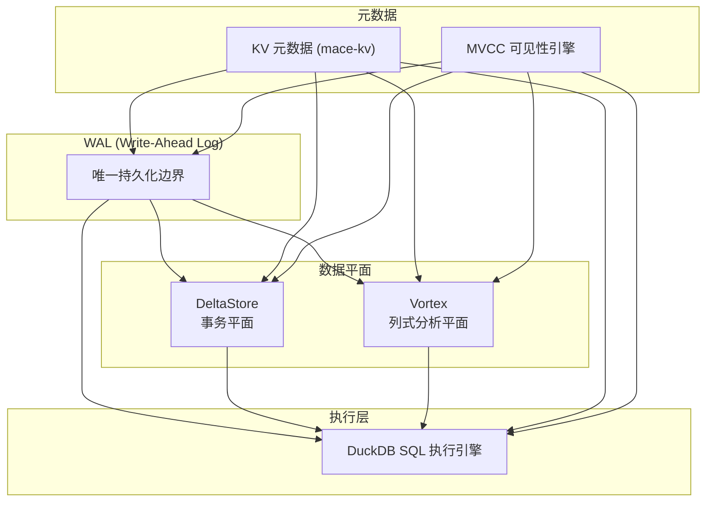
```mermaid
graph TB
    subgraph WAL["WAL (Write-Ahead Log)"]
        W["唯一持久化边界"]
    end
    subgraph Data["数据平面"]
        D1["DeltaStore<br/>事务平面"]
        D2["Vortex<br/>列式分析平面"]
    end
    subgraph Exec["执行层"]
        E["DuckDB SQL 执行引擎"]
    end
    subgraph Meta["元数据"]
        M1["KV 元数据 (mace-kv)"]
        M2["MVCC 可见性引擎"]
    end
    W --> D1
    W --> D2
    W --> E
    D1 --> E
    D2 --> E
    M1 --> W
    M1 --> D1
    M1 --> D2
    M1 --> E
    M2 --> W
    M2 --> D1
    M2 --> D2
    M2 --> E
```

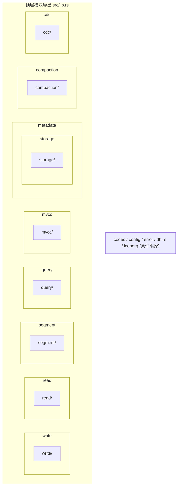
```mermaid
graph TB
    subgraph Lib["顶层模块导出 src/lib.rs"]
        subgraph M1["write"]
            W1["write/"]
        end
        subgraph M2["read"]
            R1["read/"]
        end
        subgraph M3["storage"]
            S1["storage/"]
        end
        subgraph M4["segment"]
            S2["segment/"]
        end
        subgraph M5["query"]
            Q1["query/"]
        end
        subgraph M6["mvcc"]
            Mv1["mvcc/"]
        end
        subgraph M7["metadata"]
            M3["metadata/"]
        end
        subgraph M8["compaction"]
            C1["compaction/"]
        end
        subgraph M9["cdc"]
            Cd1["cdc/"]
        end
    end
    Infra["codec / config / error / db.rs / iceberg (条件编译)"]
```

---

## 全局数据流

### 写路径（Commit 路径）

事务提交的完整执行链是所有模块的交叉点：

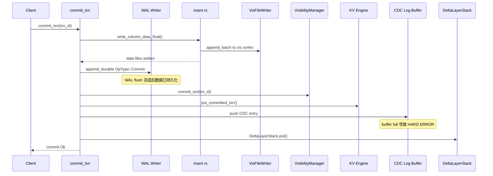
```mermaid
sequenceDiagram
    participant C as Client
    participant DB as commit_txn
    participant WAL as WAL Writer
    participant INS as insert.rs
    participant VIS as VisFileWriter
    participant MVCC as VisibilityManager
    participant KV as KV Engine
    participant CDC as CDC Log Buffer
    participant DELTA as DeltaLayerStack

    C->>DB: commit_txn(txn_id)

    DB->>INS: write_column_data_final()
    INS->>VIS: append_batch to vis vortex
    INS-->>DB: data files written

    DB->>WAL: append_durable OpType::Commit
    Note over WAL: WAL flush 完成后数据已持久化

    DB->>MVCC: commit_txn(txn_id)
    DB->>KV: put_committed_txn()
    DB->>CDC: push CDC entry
    Note over CDC: buffer full 导致 HARD ERROR
    DB->>DELTA: DeltaLayerStack.put()
    DB-->>C: commit Ok
```

### 读路径（Scan 路径）

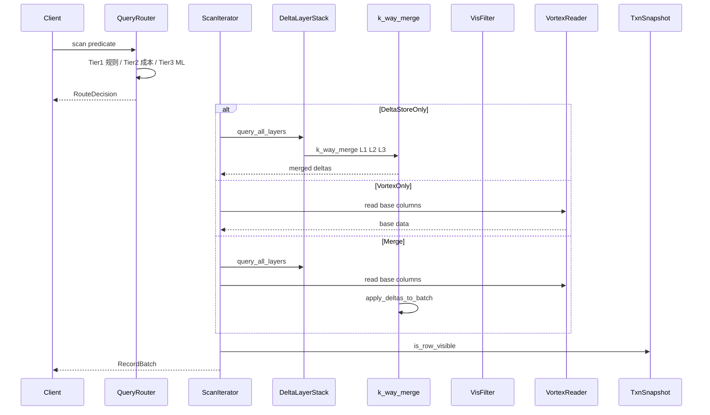
```mermaid
sequenceDiagram
    participant C as Client
    participant ROUTE as QueryRouter
    participant SCAN as ScanIterator
    participant DELTA as DeltaLayerStack
    participant MERGE as k_way_merge
    participant VIS as VisFilter
    participant VORTEX as VortexReader
    participant SNAP as TxnSnapshot

    C->>ROUTE: scan predicate
    ROUTE->>ROUTE: Tier1 规则 / Tier2 成本 / Tier3 ML
    ROUTE-->>C: RouteDecision

    alt DeltaStoreOnly
        SCAN->>DELTA: query_all_layers
        DELTA->>MERGE: k_way_merge L1 L2 L3
        MERGE-->>SCAN: merged deltas
    else VortexOnly
        SCAN->>VORTEX: read base columns
        VORTEX-->>SCAN: base data
    else Merge
        SCAN->>DELTA: query_all_layers
        SCAN->>VORTEX: read base columns
        MERGE->>MERGE: apply_deltas_to_batch
    end

    SCAN->>SNAP: is_row_visible
    SCAN-->>C: RecordBatch
```

### 恢复路径

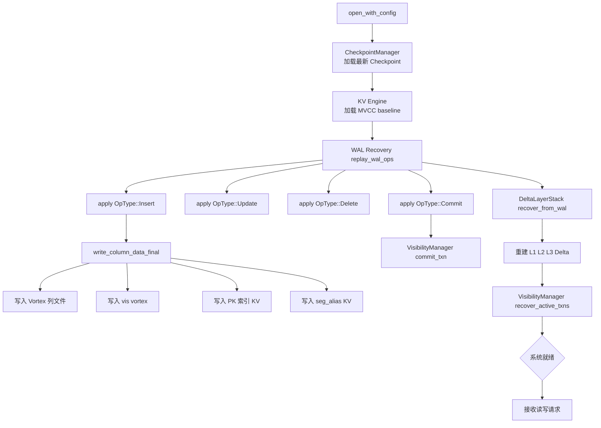
```mermaid
flowchart TB
    A["open_with_config"]
    B["CheckpointManager<br/>加载最新 Checkpoint"]
    C["KV Engine<br/>加载 MVCC baseline"]
    D["WAL Recovery replay_wal_ops"]
    E["apply OpType::Insert"]
    F["apply OpType::Update"]
    F2["apply OpType::Delete"]
    G["apply OpType::Commit"]
    H["write_column_data_final"]
    H1["写入 Vortex 列文件"]
    H2["写入 vis vortex"]
    H3["写入 PK 索引 KV"]
    H4["写入 seg_alias KV"]
    I["VisibilityManager commit_txn"]
    J["DeltaLayerStack recover_from_wal"]
    K["重建 L1 L2 L3 Delta"]
    L["VisibilityManager recover_active_txns"]
    M{"系统就绪"}
    N["接收读写请求"]

    A --> B --> C --> D
    D --> E
    D --> F
    D --> F2
    D --> G
    E --> H --> H1
    H --> H2
    H --> H3
    H --> H4
    G --> I
    D --> J
    J --> K --> L --> M --> N
```

---

## 持久化层

### WAL OpType 全枚举

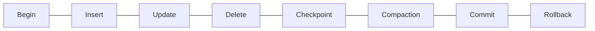
```mermaid
graph LR
    A["Begin"] --- B["Insert"]
    B --- C["Update"]
    C --- D["Delete"]
    D --- E["Checkpoint"]
    E --- F["Compaction"]
    F --- G["Commit"]
    G --- H["Rollback"]
```

### WAL 状态机

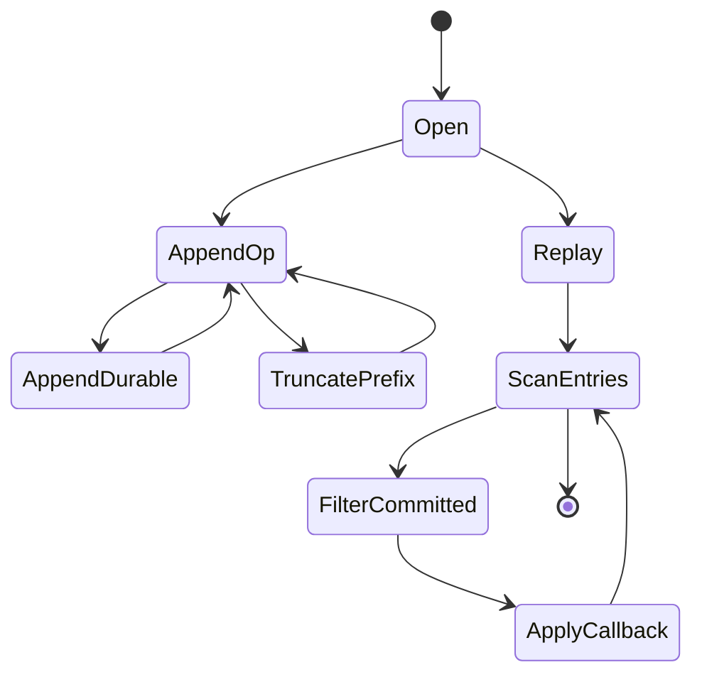
```mermaid
stateDiagram-v2
    [*] --> Open
    Open --> AppendOp
    AppendOp --> AppendDurable
    AppendDurable --> AppendOp
    AppendOp --> TruncatePrefix
    TruncatePrefix --> AppendOp
    Open --> Replay
    Replay --> ScanEntries
    ScanEntries --> FilterCommitted
    FilterCommitted --> ApplyCallback
    ApplyCallback --> ScanEntries
    ScanEntries --> [*]
```

### Checkpoint 7 步协议

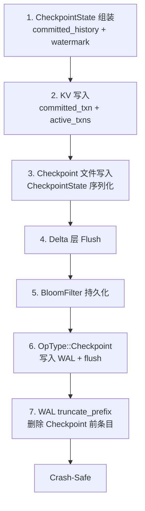
```mermaid
flowchart TB
    A["1. CheckpointState 组装<br/>committed_history + watermark"]
    B["2. KV 写入<br/>committed_txn + active_txns"]
    C["3. Checkpoint 文件写入<br/>CheckpointState 序列化"]
    D["4. Delta 层 Flush"]
    E["5. BloomFilter 持久化"]
    F["6. OpType::Checkpoint<br/>写入 WAL + flush"]
    G["7. WAL truncate_prefix<br/>删除 Checkpoint 前条目"]
    H["Crash-Safe"]

    A --> B --> C --> D --> E --> F --> G --> H
```

---

## MVCC 事务与可见性

### 可见性判断决策流

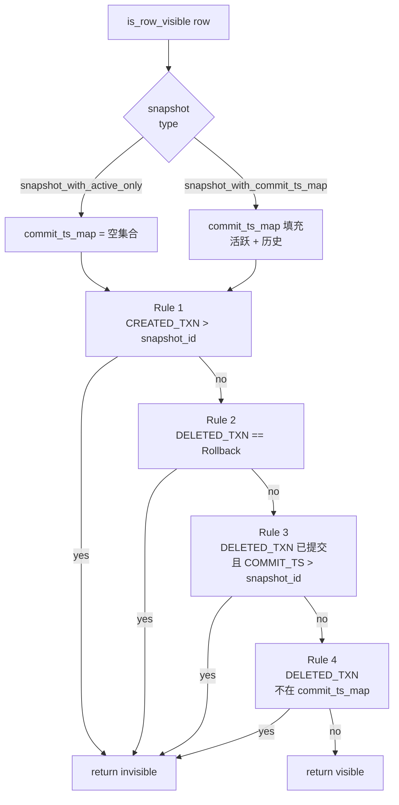
```mermaid
flowchart TD
    START["is_row_visible row"] --> SNAP{"snapshot<br/>type"}
    SNAP -->|"snapshot_with_active_only"| A1["commit_ts_map = 空集合"]
    SNAP -->|"snapshot_with_commit_ts_map"| A2["commit_ts_map 填充<br/>活跃 + 历史"]
    A1 --> R1["Rule 1<br/>CREATED_TXN > snapshot_id"]
    A2 --> R1
    R1 -->|yes| INV["return invisible"]
    R1 -->|no| R2["Rule 2<br/>DELETED_TXN == Rollback"]
    R2 -->|yes| INV
    R2 -->|no| R3["Rule 3<br/>DELETED_TXN 已提交<br/>且 COMMIT_TS > snapshot_id"]
    R3 -->|yes| INV
    R3 -->|no| R4["Rule 4<br/>DELETED_TXN<br/>不在 commit_ts_map"]
    R4 -->|yes| INV
    R4 -->|no| VIS["return visible"]
```

### 可见性规则与可见性表面

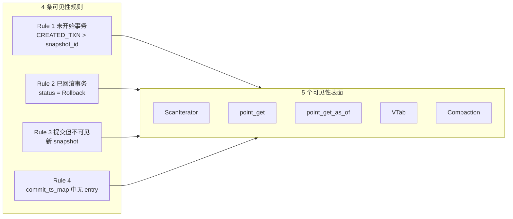
```mermaid
graph LR
    subgraph Rules["4 条可见性规则"]
        R1["Rule 1 未开始事务<br/>CREATED_TXN > snapshot_id"]
        R2["Rule 2 已回滚事务<br/>status = Rollback"]
        R3["Rule 3 提交但不可见<br/>新 snapshot"]
        R4["Rule 4<br/>commit_ts_map 中无 entry"]
    end

    subgraph Surfaces["5 个可见性表面"]
        S1["ScanIterator"]
        S2["point_get"]
        S3["point_get_as_of"]
        S4["VTab"]
        S5["Compaction"]
    end

    R1 --> Surfaces
    R2 --> Surfaces
    R3 --> Surfaces
    R4 --> Surfaces
```

### MVCC 状态机

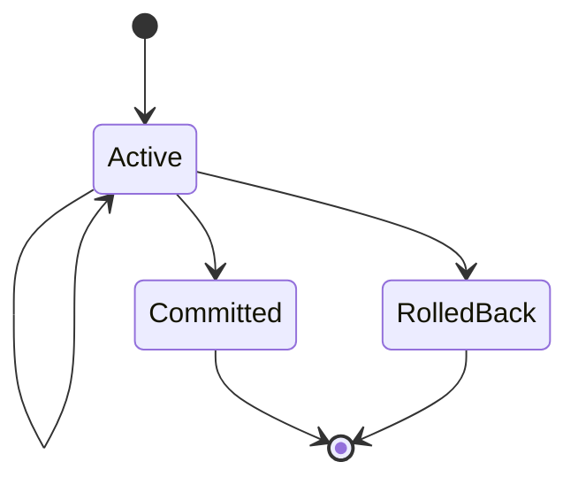
```mermaid
stateDiagram-v2
    [*] --> Active
    Active --> Active
    Active --> Committed
    Active --> RolledBack
    Committed --> [*]
    RolledBack --> [*]
```

### VisibilityManager 职责

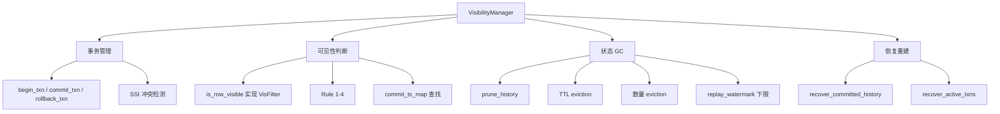
```mermaid
flowchart TD
    VM["VisibilityManager"]

    VM --> TXN["事务管理"]
    TXN --> T1["begin_txn / commit_txn / rollback_txn"]
    TXN --> T2["SSI 冲突检测"]

    VM --> VIS["可见性判断"]
    VIS --> V1["is_row_visible 实现 VisFilter"]
    VIS --> V2["Rule 1-4"]
    VIS --> V3["commit_ts_map 查找"]

    VM --> GC["状态 GC"]
    GC --> G1["prune_history"]
    GC --> G2["TTL eviction"]
    GC --> G3["数量 eviction"]
    GC --> G4["replay_watermark 下限"]

    VM --> REC["恢复重建"]
    REC --> R1["recover_committed_history"]
    REC --> R2["recover_active_txns"]
```

### TxnSnapshot 结构

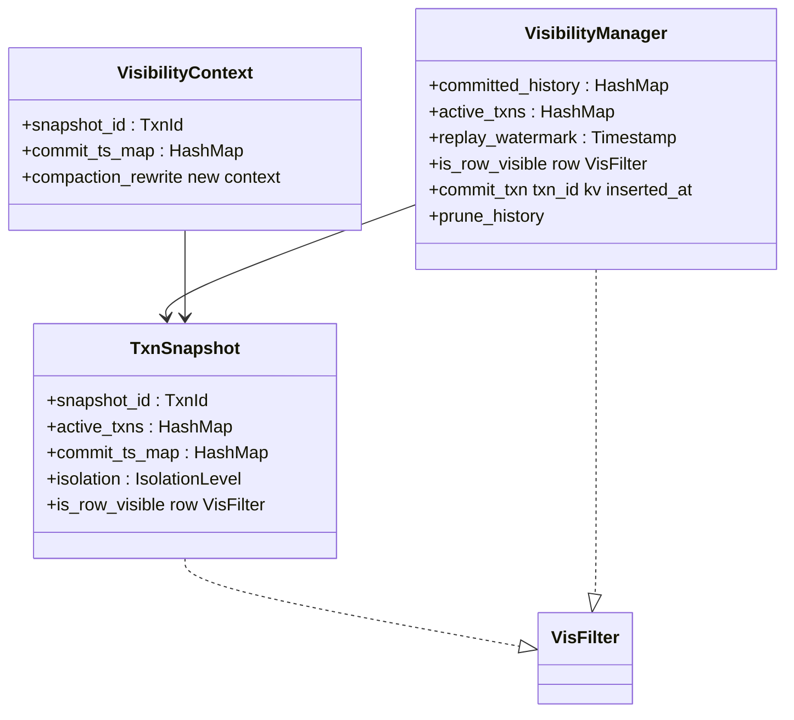
```mermaid
classDiagram
    class TxnSnapshot {
        +snapshot_id : TxnId
        +active_txns : HashMap
        +commit_ts_map : HashMap
        +isolation : IsolationLevel
        +is_row_visible row VisFilter
    }

    class VisibilityContext {
        +snapshot_id : TxnId
        +commit_ts_map : HashMap
        +compaction_rewrite new context
    }

    class VisibilityManager {
        +committed_history : HashMap
        +active_txns : HashMap
        +replay_watermark : Timestamp
        +is_row_visible row VisFilter
        +commit_txn txn_id kv inserted_at
        +prune_history
    }

    TxnSnapshot ..|> VisFilter
    VisibilityManager ..|> VisFilter
    VisibilityManager --> TxnSnapshot
    VisibilityContext --> TxnSnapshot
```

---

## 可见性数据生成

### Shadow Column Schema

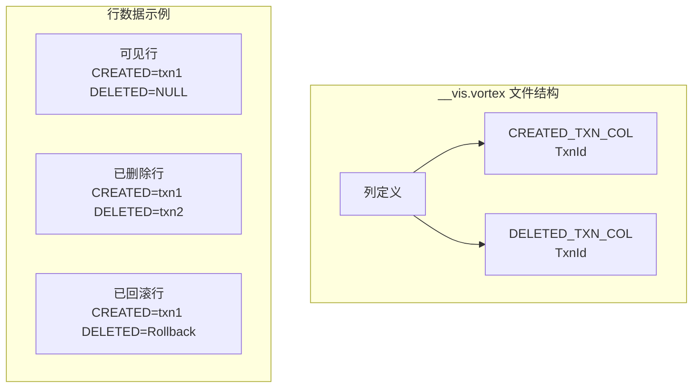
```mermaid
graph TB
    subgraph Schema["__vis.vortex 文件结构"]
        H["列定义"]
        H --> C1["CREATED_TXN_COL<br/>TxnId"]
        H --> C2["DELETED_TXN_COL<br/>TxnId"]
    end

    subgraph Rows["行数据示例"]
        R1["可见行<br/>CREATED=txn1 DELETED=NULL"]
        R2["已删除行<br/>CREATED=txn1 DELETED=txn2"]
        R3["已回滚行<br/>CREATED=txn1 DELETED=Rollback"]
    end
```

### 可见性数据生成路径

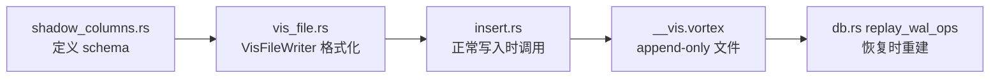
```mermaid
flowchart LR
    A["shadow_columns.rs<br/>定义 schema"]
    B["vis_file.rs<br/>VisFileWriter 格式化"]
    C["insert.rs<br/>正常写入时调用"]
    D["__vis.vortex<br/>append-only 文件"]
    E["db.rs replay_wal_ops<br/>恢复时重建"]

    A --> B --> C --> D --> E
```

---

## Delta 三层存储

### 三层架构

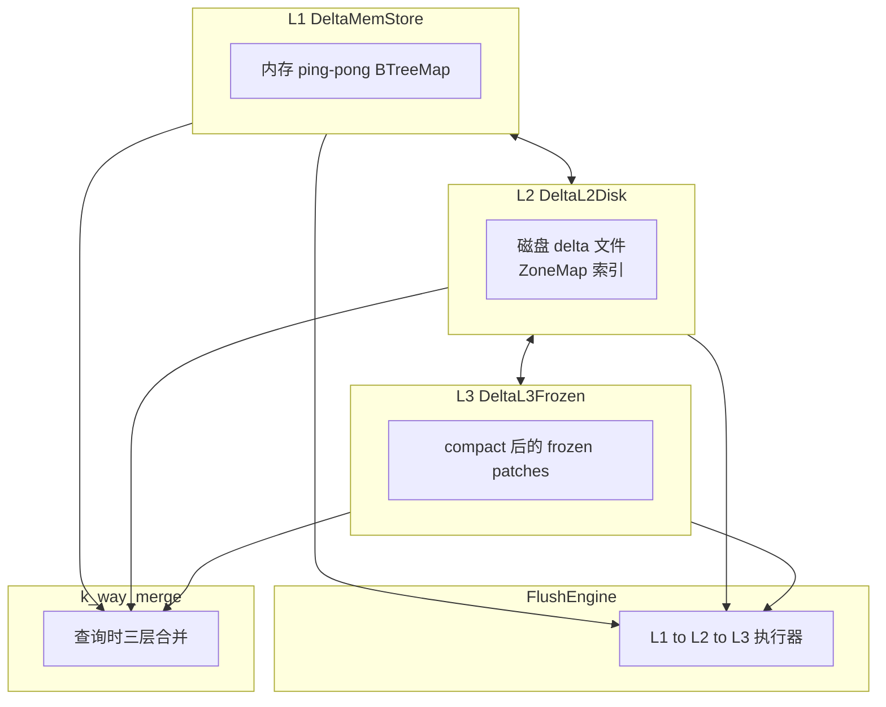
```mermaid
flowchart TB
    subgraph L1["L1 DeltaMemStore"]
        L1A["内存 ping-pong BTreeMap"]
    end
    subgraph L2["L2 DeltaL2Disk"]
        L2A["磁盘 delta 文件<br/>ZoneMap 索引"]
    end
    subgraph L3["L3 DeltaL3Frozen"]
        L3A["compact 后的 frozen patches"]
    end
    subgraph Engine["FlushEngine"]
        FE["L1 to L2 to L3 执行器"]
    end
    subgraph Query["k_way_merge"]
        KM["查询时三层合并"]
    end

    L1 <--> L2
    L2 <--> L3
    L1 --> FE
    L2 --> FE
    L3 --> FE
    L1 --> KM
    L2 --> KM
    L3 --> KM
```

### FlushEngine 状态机

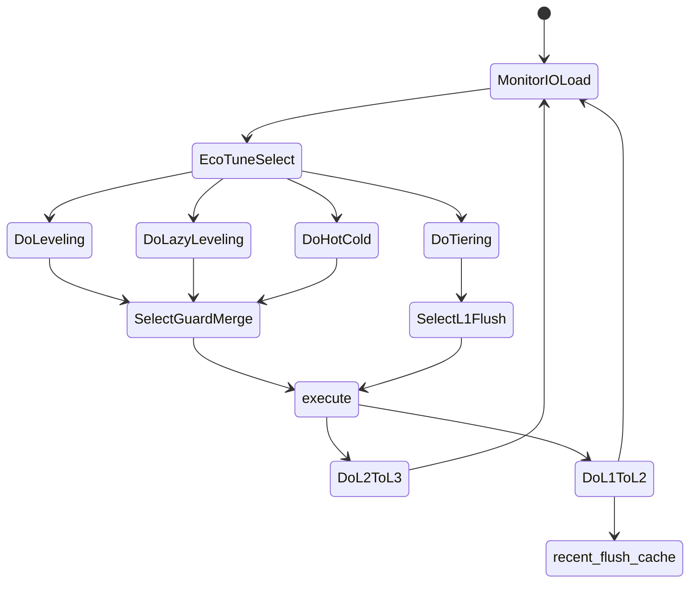
```mermaid
stateDiagram-v2
    [*] --> MonitorIOLoad
    MonitorIOLoad --> EcoTuneSelect
    EcoTuneSelect --> DoLeveling
    EcoTuneSelect --> DoTiering
    EcoTuneSelect --> DoLazyLeveling
    EcoTuneSelect --> DoHotCold

    DoLeveling --> SelectGuardMerge
    DoTiering --> SelectL1Flush
    DoLazyLeveling --> SelectGuardMerge
    DoHotCold --> SelectGuardMerge

    SelectGuardMerge --> execute
    SelectL1Flush --> execute

    execute --> DoL2ToL3
    execute --> DoL1ToL2
    DoL1ToL2 --> recent_flush_cache
    DoL1ToL2 --> MonitorIOLoad
    DoL2ToL3 --> MonitorIOLoad
```

### recent_flush 竞态修复

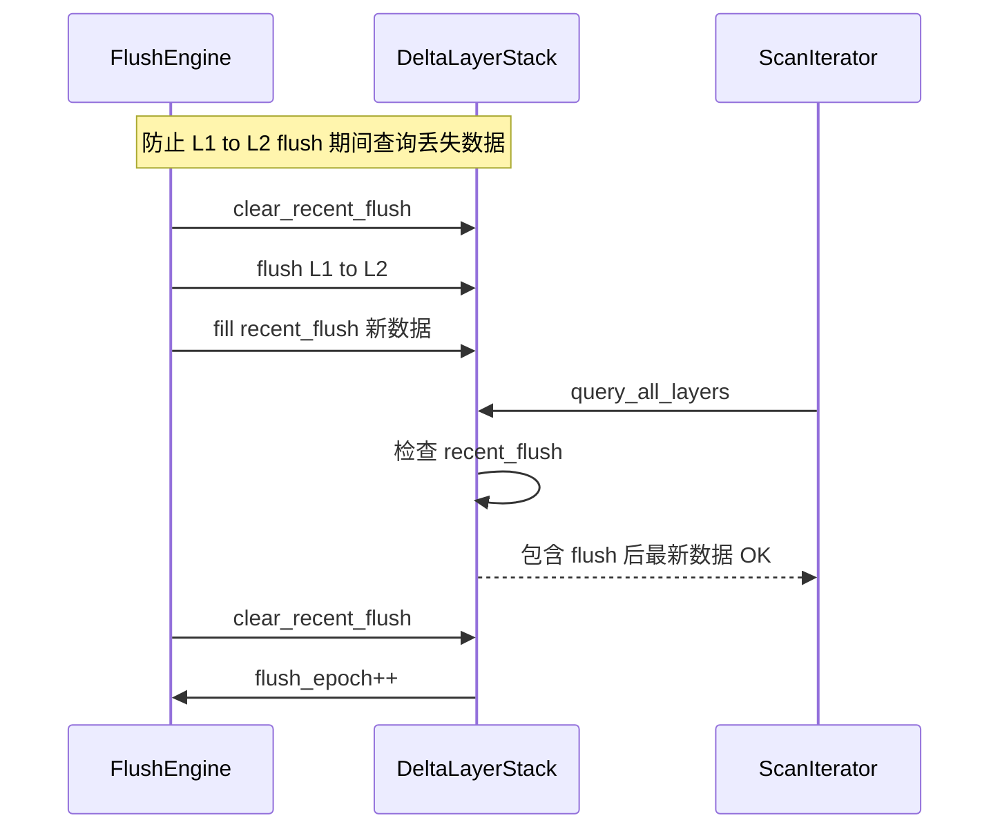
```mermaid
sequenceDiagram
    participant FLUSH as FlushEngine
    participant DELTA as DeltaLayerStack
    participant QUERY as ScanIterator

    Note over FLUSH,DELTA: 防止 L1 to L2 flush 期间查询丢失数据

    FLUSH->>DELTA: clear_recent_flush
    FLUSH->>DELTA: flush L1 to L2
    FLUSH->>DELTA: fill recent_flush 新数据

    QUERY->>DELTA: query_all_layers
    DELTA->>DELTA: 检查 recent_flush
    DELTA-->>QUERY: 包含 flush 后最新数据 OK

    FLUSH->>DELTA: clear_recent_flush
    DELTA->>FLUSH: flush_epoch++
```

---

## 写入端点

### Insert Phase 执行顺序

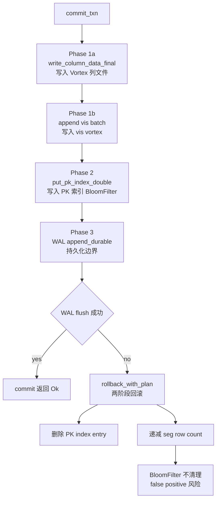
```mermaid
flowchart TB
    A["commit_txn"]
    B["Phase 1a<br/>write_column_data_final<br/>写入 Vortex 列文件"]
    C["Phase 1b<br/>append vis batch<br/>写入 vis vortex"]
    D["Phase 2<br/>put_pk_index_double<br/>写入 PK 索引 BloomFilter"]
    E["Phase 3<br/>WAL append_durable<br/>持久化边界"]
    F{"WAL flush 成功"}
    G["commit 返回 Ok"]
    H["rollback_with_plan<br/>两阶段回滚"]
    I["删除 PK index entry"]
    J["递减 seg row count"]
    K["BloomFilter 不清理<br/>false positive 风险"]

    A --> B --> C --> D --> E --> F
    F -->|yes| G
    F -->|no| H --> I
    H --> J
    J --> K
```

### Update 的 Before 与 After Image

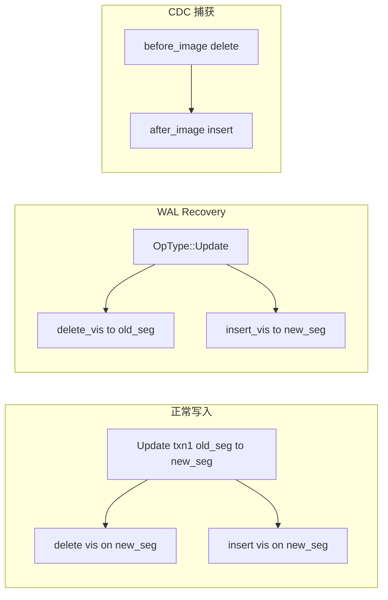
```mermaid
flowchart LR
    subgraph Normal["正常写入"]
        U1["Update txn1 old_seg to new_seg"]
        U1 --> U1a["delete vis on new_seg"]
        U1 --> U1b["insert vis on new_seg"]
    end

    subgraph Recovery["WAL Recovery"]
        R1["OpType::Update"]
        R1 --> R2["delete_vis to old_seg"]
        R1 --> R3["insert_vis to new_seg"]
    end

    subgraph CDC["CDC 捕获"]
        C1["before_image delete"]
        C1 --> C2["after_image insert"]
    end
```

---

## Segment 文件结构

### Segment 目录布局

```mermaid
graph TB
    subgraph Seg["segments seg_id 目录结构"]
        S1["__vis.vortex 可见性列"]
        S2["col_0.vortex 数据列"]
        S3["col_1.vortex 数据列"]
        S4["zone_map.bin ZoneMap 元数据"]
        S5["bloom_filter.bin BloomFilter"]
        S6["meta.json SegmentMeta"]
    end
```

### SegmentOverlay 与 Compaction 可见性

```mermaid
flowchart TB
    START["Compaction Rewrite"]
    OVERLAY["SegmentOverlay new<br/>COMPACTION_SNAPSHOT_ID"]
    READ["读取原 segment 所有行"]
    FILTER["apply_deltas_to_batch"]
    VISFILTER["VisFilter 过滤"]
    WRITE["写入新 segment 新 seg_id"]
    VCTX["VisibilityContext compaction_rewrite"]
    SNAP["snapshot_id 更新<br/>= COMPACTION_SNAPSHOT_ID"]
    MAP["commit_ts_map 置空"]
    DONE["Compaction 完成"]

    START --> OVERLAY --> READ --> FILTER --> VISFILTER --> WRITE --> VCTX --> SNAP --> MAP --> DONE
```

---

## KV 元数据

### Column Family 权威分层

```mermaid
flowchart TB
    subgraph T1["T1 事实权威 WAL replay 直接写入"]
        T1A["CF_PK_IDX"]
        T1B["CF_SEG_META"]
        T1C["seg_alias"]
    end

    subgraph T2["T2 推断权威 flush scan 时计算"]
        T2A["CF_ZONE"]
        T2B["CF_BF"]
        T2C["CF_LBF"]
        T2D["CF_STAT"]
    end

    subgraph T3["T3 缓存权威 可从 WAL 重建"]
        T3A["CF_DELTA"]
        T3B["CF_VERSIONS"]
    end

    subgraph T4["系统与外部"]
        T4A["CF_SYS"]
        T4B["CF_ICEBERG"]
        T4C["CF_LAYER"]
    end
```

### KV 状态机

```mermaid
stateDiagram-v2
    [*] --> KVOpen

    KVOpen --> LoadCF_PK_IDX
    KVOpen --> LoadCF_MVCC
    LoadCF_MVCC --> LoadCF_VERSIONS

    LoadCF_PK_IDX --> WALReplay
    LoadCF_MVCC --> WALReplay
    LoadCF_VERSIONS --> WALReplay

    WALReplay --> WritePK
    WALReplay --> WriteSegMeta
    WALReplay --> WriteAlias

    WALReplay --> CheckpointWrite
    CheckpointWrite --> KVWrite
    CheckpointWrite --> KVWrite2
```

---

## 查询路由

### 三层路由决策

```mermaid
flowchart TD
    START["scan or point_get"]
    T1{"PointGet 查询"}

    T1 -->|yes| R1["DeltaStoreOnly 规则"]
    T1 -->|no| T2["Tier2 评估统计信息<br/>ZoneMap 裁剪率<br/>Delta 行数 vs Vortex 行数"]

    T2 --> DECIDE2{"成本比较"}
    DECIDE2 -->|Delta 远小于 Vortex| R2A["DeltaStoreOnly"]
    DECIDE2 -->|Vortex 远小于 Delta| R2B["VortexOnly"]
    DECIDE2 -->|成本接近| R2C["Merge"]

    R1 --> END["执行查询"]
    R2A --> END
    R2B --> END
    R2C --> END

    T2 --> T3["Tier3 Tree-CNN ML<br/>影子模式 记录预测"]
    T3 -->|"不参与路由"| END
```

### QueryRouter 类图

```mermaid
classDiagram
    class QueryRouter {
        +route query RouteDecision
        +tier1_decide query RouteDecision
        +tier2_decide query RouteDecision
        +tier3_decide query RouteDecision
    }

    class FeedbackState {
        +record_result decision actual_cost
        +get_statistics RoutingStats
    }

    class RouteDecision {
        <<enumeration>>
        DeltaStoreOnly
        VortexOnly
        Merge
    }

    class ProjectionContract {
        +assert_blocking_governance snapshot plan
    }

    QueryRouter ..|> RouteDecision
    FeedbackState --> QueryRouter
    QueryRouter --> ProjectionContract
```

---

## 扫描执行

### ScanIterator 执行流程

```mermaid
flowchart TB
    A["ScanIterator new"]
    B["execution_template 规划"]
    C{"RouteDecision"}

    C -->|"Merge"| D["并发读取<br/>DeltaQueryLayer + VortexReader"]
    C -->|"DeltaStoreOnly"| E["仅 DeltaQueryLayer"]
    C -->|"VortexOnly"| F["仅 VortexReader"]

    D --> G["k_way_merge apply_deltas_to_batch"]
    E --> G
    F --> G

    G --> H["VisFilter is_row_visible TxnSnapshot"]
    H --> I["Rule 1-4"]
    I --> J{"visible"}
    J -->|yes| K["collect 行"]
    J -->|no| L["skip 行"]
    K --> M["cooperative merge 时间片"]
    L --> M
    M --> M
    M --> N["返回 RecordBatch"]

    A --> B --> C
```

---

## VTab 适配器

### VTab 执行路径

```mermaid
flowchart LR
    A["DuckDB SQL<br/>SELECT FROM docdb_scan"]
    B["DuckDB VTab Bind Phase"]
    C["BindData new<br/>snapshot + projection_contract"]
    D["lazy_init_readers"]
    E["TLS VTAB_ROCKDUCK"]
    F["DuckDB VTab Init Phase"]
    G["DuckDB VTab func Phase"]
    H["lazy_init_readers 延迟打开"]
    I["filter_by_visibility<br/>vtab_quack 241-321"]
    J["TxnSnapshot is_row_visible"]
    K["Rule 1-4"]
    L["DuckDB RecordBatch"]

    A --> B --> C --> D --> E --> F --> G --> H --> I --> J --> K --> L
```

### VTab vs ScanIterator 执行路径对比

```mermaid
flowchart LR
    subgraph VTab["VTab 路径"]
        V1["DuckDB VTab trait"]
        V2["TLS 获取 RockDuck"]
        V3["lazy_init_readers"]
        V4["filter_by_visibility"]
        V5["DuckDB RecordBatch"]
        V1 --> V2 --> V3 --> V4 --> V5
    end

    subgraph Scan["ScanIterator 路径"]
        S1["RockDuck scan"]
        S2["QueryRouter 路由"]
        S3["DeltaLayerStack k_way_merge"]
        S4["VisFilter is_row_visible"]
        S5["RecordBatch"]
        S1 --> S2 --> S3 --> S4 --> S5
    end
```

---

## Compaction 系统

### 两套决策语言

```mermaid
flowchart LR
    subgraph Flush["FlushEngine storage delta"]
        F1["CompactionPolicy<br/>Leveling Tiering<br/>LazyLeveling HotCold"]
        F2["CompactionPriority<br/>Flush Minor Major"]
        F3["FlushLevel<br/>L1 to L2 L2 to L3"]
        F4["EcoTunePolicy"]
    end

    subgraph Sched["CompactionScheduler compaction"]
        S1["CompactionStrategy<br/>PdtMerge SmallFileMerge<br/>QueryDriven stub"]
        S2["RewriteAction<br/>Pdt Small Guard L2L3"]
        S3["CompactionTask<br/>BinaryHeap 优先级队列"]
        S4["AdaptiveCompactionScheduler<br/>hill climbing"]
    end
```

### Compaction 阶段机

```mermaid
stateDiagram-v2
    [*] --> Idle
    Idle --> Scanning
    Scanning --> Evaluating
    Evaluating --> PdtMerge
    Evaluating --> SmallFileMerge
    Evaluating --> GuardMerge
    Evaluating --> L2ToL3
    Evaluating --> Backoff

    PdtMerge --> Writing
    SmallFileMerge --> Writing
    GuardMerge --> Writing
    L2ToL3 --> Writing

    Writing --> WALLog
    WALLog --> AliasUpdate
    AliasUpdate --> KVUpdate
    KVUpdate --> Done

    Backoff --> Idle
    Done --> Idle
```

### PDT Merge 流程

```mermaid
flowchart TB
    A["AdaptiveCompactionScheduler<br/>hill climbing"]
    B["CompactionScheduler<br/>任务入队"]
    C["NonBlockingCompactor<br/>run_compaction"]

    C --> D["PDT Merge 读取旧 segment"]
    C --> I["SmallFileMerge 串行多个 PDT"]
    C --> J["QueryDriven stub 跳过"]

    D --> E["apply_deltas delta 合并"]
    E --> G["VisFilter 过滤"]
    G --> H["写入新 segment 新 seg_id"]

    I --> D

    H --> K["WAL OpType Compaction"]
    K --> L["seg_alias 更新"]
    L --> M["PK index 更新"]
    M --> N["BloomFilter 更新"]
```

---

## CDC 变更捕获

### CDC 集成点

```mermaid
flowchart TB
    START["commit_txn"]
    P["pending_cdc_entries 收集"]
    E{"cdc.enabled"}
    SKIP["收集但不使用 死代码"]
    PUSH["cdc_log_buffer push"]
    FULL{"buffer 满"}
    ERR["HARD ERROR<br/>阻止 commit"]
    CWAL["CdcWalWriter append_and_flush"]
    DONE["commit 返回 Ok"]
    WARN["log warning<br/>at-least-once 降级"]

    START --> P --> E
    E -->|false| SKIP
    E -->|true| PUSH --> FULL
    FULL -->|yes| ERR
    FULL -->|no| CWAL
    CWAL -->|"成功"| DONE
    CWAL -->|"失败"| WARN
    WARN --> DONE
```

### CDC 数据流

```mermaid
flowchart LR
    A["Insert after image"] --> B["CdcLogEntry"]
    C["Update before + after"] --> B
    D["Delete before image"] --> B

    B --> E["CdcLogBuffer 内存缓冲"]
    E --> F["CdcWalWriter 持久化"]
    F --> G["ChangeStream 事件流"]
    G --> H["Debezium 格式转换"]
    H --> I["Kafka Sink 可选"]
    G --> J["Time-Travel 查询"]
```

---

## Iceberg Export

```mermaid
flowchart TB
    A["IcebergExport export"]
    B{"格式选择"}
    C["Parquet 写入<br/>parquet_format.rs"]
    D["ORC 写入 TODO"]
    E["VortexWriter scaffolded"]

    C --> F["iceberg translate to spec"]
    E --> F

    F --> G["Iceberg Manifest"]
    F --> H["Iceberg Metadata"]
    G --> I["S3 HDFS"]
    H --> I
```

---

## 横切治理层

### ProjectionContract 治理断言

```mermaid
flowchart TB
    A["QueryRouter route"]
    B["vtab_quack Bind"]
    C["assert_blocking_governance"]
    D{"governance 违规"}
    PANIC["panic 硬性边界"]
    CONTINUE["继续执行"]
    Q["Query 执行"]

    A --> C
    B --> C
    C --> D
    D -->|yes| PANIC
    D -->|no| CONTINUE --> Q
    PANIC --> E["断言失败"]
```

### Governance 层

```mermaid
flowchart TD
    GOV["Governance"]

    GOV --> PC["ProjectionContract"]
    PC --> PC1["assert_blocking_governance"]
    PC --> PC2["EvidenceSnapshot"]
    PC --> PC3["SidecarEvidenceSnapshot"]

    GOV --> CX["Cross-Cutting"]
    CX --> C1["query routing mod.rs"]
    CX --> C2["query vtab_quack.rs"]
    CX --> C3["metadata projection.rs"]

    GOV --> EH["Evidence Hook"]
    EH --> E1["硬编码字符串"]
    EH --> E2["非运行时验证"]
    EH --> E3["Hint layer 非强制"]

---

## 模块依赖全景

```mermaid
flowchart TB
    subgraph FOUND["共享基础设施"]
        CODEC["codec 序列化"]
        CONFIG["config 配置"]
        ERROR["error 错误"]
        KV["KV Engine mace-kv"]
    end

    subgraph PERSIST["持久化层"]
        WAL["durability_wal WAL Writer"]
        WALREC["wal_recovery WAL Recovery"]
        CHECK["checkpoint Checkpoint"]
    end

    subgraph MVCC["事务层"]
        VIS["mvcc visibility<br/>VisibilityManager"]
        SNAP["TxnSnapshot"]
        SHADOW["shadow_columns<br/>Shadow Column"]
    end

    subgraph WRITE["写入层"]
        INSERT["insert 数据写入"]
        VISFILE["vis_file VisFileWriter"]
        GROUP["group_commit"]
        HEAT["heat_tracker"]
    end

    subgraph STORAGE["存储层"]
        DELTA["DeltaLayerStack L1 L2 L3"]
        FLUSH["FlushEngine"]
        VORTEX["Vortex 列式"]
        FM["FileManager"]
    end

    subgraph SEGMENT["Segment"]
        LAYOUT["SegmentLayout"]
        OVERLAY["SegmentOverlay"]
        META["SegmentMeta"]
    end

    subgraph QUERY["查询层"]
        ROUTE["QueryRouter"]
        SCAN["ScanIterator"]
        POINT["point_get"]
        VTAB["vtab_quack"]
        TIME["time_travel"]
    end

    subgraph MAINT["维护层"]
        COMP["CompactionScheduler"]
        NONBLOCK["NonBlockingCompactor"]
        ADAPT["AdaptiveCompactionScheduler"]
    end

    subgraph CDCEX["CDC层"]
        CDCLOG["cdc log"]
        CDCSTREAM["cdc stream"]
        DEBEZIUM["debezium"]
    end

    subgraph ICEX["Iceberg"]
        ICE["iceberg export"]
    end

    DB["db 根协调"] --> CODEC
    DB --> CONFIG
    DB --> ERROR
    DB --> KV

    DB --> WAL
    WAL --> CODEC
    WAL --> CHECK

    WALREC --> WAL
    WALREC --> CODEC
    WALREC --> INSERT
    WALREC --> VIS
    WALREC --> DELTA
    WALREC --> KV

    CHECK --> KV
    CHECK --> VIS

    INSERT --> CODEC
    INSERT --> LAYOUT
    INSERT --> VORTEX
    INSERT --> VISFILE
    INSERT --> KV
    INSERT --> DELTA

    VISFILE --> CODEC
    VISFILE --> SHADOW

    DELTA --> FLUSH
    DELTA --> KV

    FLUSH --> DELTA
    FLUSH --> HEAT

    ROUTE --> KV
    ROUTE --> DELTA
    ROUTE --> META

    SCAN --> DELTA
    SCAN --> VORTEX
    SCAN --> VIS
    SCAN --> FM
    SCAN --> ROUTE
    SCAN --> OVERLAY

    POINT --> DELTA
    POINT --> VIS
    POINT --> FM

    VTAB --> VIS
    VTAB --> VORTEX
    VTAB --> META
    VTAB --> DB

    COMP --> ADAPT
    COMP --> NONBLOCK
    NONBLOCK --> DELTA
    NONBLOCK --> INSERT

    CDCLOG --> WAL
    CDCLOG --> CODEC
    CDCSTREAM --> DEBEZIUM

    ICE --> VORTEX
    ICE --> CODEC
```

---

## 共享不变量

> 以下不变量如果被违反，任何模块的测试都可能通过但系统整体错误：

```mermaid
flowchart TB
    subgraph Inv["全项目共享不变量"]
        I1["不变量 1<br/>WAL 条目与 vis vortex 一一对应"]
        I2["不变量 2<br/>committed_txn 单调性"]
        I3["不变量 3<br/>OpPayload 与实际数据等价"]
        I4["不变量 4<br/>recent_flush 是瞬态"]
        I5["不变量 5<br/>5 个可见性表面共享同一 VisFilter"]
        I6["不变量 6<br/>CDC buffer 与 WAL commit 原子性"]
    end
```

---

## 项目信息

| 项目 | 信息 |
|---|---|
| 名称 | RockDuck |
| 版本 | 0.2.0 |
| 语言 | Rust |
| 类型 | HTAP 嵌入式数据库 |
| 核心存储 | DeltaStore OLTP + Vortex 列式 OLAP |
| SQL 引擎 | DuckDB |
| KV 后端 | mace-kv |
| 特性 | CDC · Iceberg Export 条件编译 |

---

*本 README 基于 RockDuck 架构分析报告生成。*
