# RockDuck

### HTAP 嵌入式数据库 | Hybrid Transactional & Analytical Processing Database

**事务**（DeltaStore 行级增量） + **分析**（Vortex 列式存储） + **引擎**（DuckDB SQL 执行）

```
版本 0.1.0 | Rust 1.91+ | Apache 2.0
```

---

## 目录

- [核心理念](#核心理念)
- [快速开始](#快速开始)
- [HTAP 端到端工作流](#htap-端到端工作流)
- [架构总览](#架构总览)
- [存储层次](#存储层次)
- [MVCC 与 Time-Travel](#mvcc-与-time-travel)
- [自适应删除掩码](#自适应删除掩码)
- [自适应列编码](#自适应列编码)
- [HTAP 双存储路由](#htap-双存储路由)
- [写入路径](#写入路径)
- [读取路径](#读取路径)
- [Compaction 调度](#compaction-调度)
- [PDT Merge Compaction](#pdt-merge-compaction)
- [Query Feedback — 自适应 Compaction](#query-feedback--自适应-compaction)
- [Iceberg v2 导出](#iceberg-v2-导出)
- [DuckDB 集成](#duckdb-集成)
- [配置参考](#配置参考)
- [核心模块一览](#核心模块一览)

---

## 核心理念

RockDuck 是一个用 Rust 构建的 **HTAP 嵌入式数据库**，同时支持事务型（OLTP）和分析型（OLAP）工作负载。它的名字取自三项核心能力的首字母组合：**事务**（行级增量存储） + **分析**（列式存储） + **引擎**（DuckDB SQL 执行）。

RockDuck 的架构深受三个成熟系统的启发：


| 灵感来源                | 借鉴的设计                                                                                   |
| ------------------- | -------------------------------------------------------------------------------------- |
| **Apache Iceberg**  | Shadow Column MVCC（通过 `created_by_txn` / `deleted_by_txn` 实现多版本快照隔离）                     |
| **ClickHouse MergeTree** | Segment / Granule 分层组织，后台 Compaction 合并，将写入的活跃数据与冻结的分析数据分层管理               |
| **Snowflake**       | Zone Map 谓词下推（per-granule min/max 统计跳过无关数据块） + HTAP 双存储路由（DeltaStore 与列存分别处理 OLTP/OLAP 查询） |


---

## 快速开始

### 编译

```bash
cargo build --release
```

### Library API

```rust
use rockduck::RockDuck;
use std::sync::Arc;

let db = RockDuck::open("./data")?;

let mut cols = std::collections::HashMap::new();
cols.insert("id".to_string(), Arc::new(arrow_array::Int64Array::from(vec![1i64])) as _);
cols.insert("name".to_string(), Arc::new(arrow_array::StringArray::from(vec!["Alice"])) as _);

let txn_id = db.insert("users", b"pk001", &cols)?;

// Time-Travel 查询（TxnId = 10 时的快照）
let results = db.scan_as_of("users", 10, None, None)?;

// Iceberg 导出
let path = db.export_iceberg("users", "/tmp/iceberg_table", None).await?;
```

### CLI

```bash
# 插入
cargo run -- insert pk001 --columns id=1 --columns age=30 -t users

# 查询
cargo run -- get pk001 -t users

# 扫描
cargo run -- scan --start pk001 --end pk100 -t users

# 删除
cargo run -- delete pk001 -t users

# 统计
cargo run -- stats -t users
```

---

## HTAP 端到端工作流

RockDuck 的读写路径通过 HTAP 双存储路由实现事务与分析的统一访问：

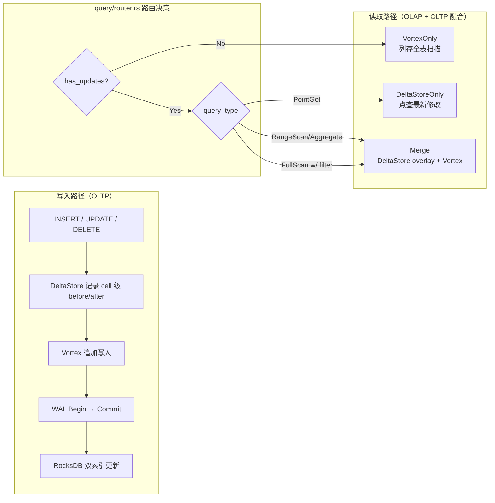
```mermaid
flowchart LR
    subgraph Write["写入路径（OLTP）"]
        W1["INSERT / UPDATE / DELETE"]
        W2["DeltaStore 记录 cell 级 before/after"]
        W3["Vortex 追加写入"]
        W4["WAL Begin → Commit"]
        W5["RocksDB 双索引更新"]
    end

    subgraph Router["query/router.rs 路由决策"]
        R1{"has_updates?"}
        R2{"query_type"}
    end

    subgraph Read["读取路径（OLAP + OLTP 融合）"]
        R_VX["VortexOnly\n列存全表扫描"]
        R_DS["DeltaStoreOnly\n点查最新修改"]
        R_MG["Merge\nDeltaStore overlay + Vortex"]
    end

    W1 --> W2 --> W3 --> W4 --> W5
    R1 -->|No| R_VX
    R1 -->|Yes| R2
    R2 -->|"PointGet"| R_DS
    R2 -->|"RangeScan/Aggregate"| R_MG
    R2 -->|"FullScan w/ filter"| R_MG
```

### DeltaStore — 事务写入与增量更新

Update 路径（`write/insert.rs`）不覆盖原 Vortex 数据，而是将变更记录到 DeltaStore：

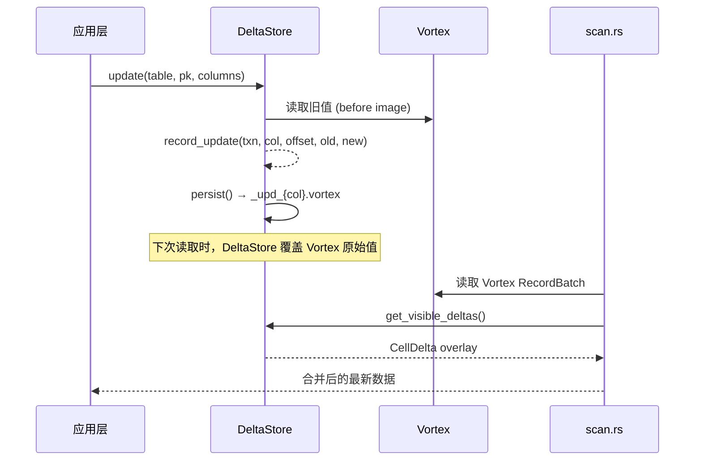
```mermaid
sequenceDiagram
    participant App as 应用层
    participant DS as DeltaStore
    participant VX as Vortex
    participant Scan as scan.rs

    App->>DS: update(table, pk, columns)
    DS->>VX: 读取旧值 (before image)
    DS-->>DS: record_update(txn, col, offset, old, new)
    DS->>DS: persist() → _upd_{col}.vortex

    Note over DS: 下次读取时，DeltaStore 覆盖 Vortex 原始值

    Scan->>VX: 读取 Vortex RecordBatch
    Scan->>DS: get_visible_deltas()
    DS-->>Scan: CellDelta overlay
    Scan-->>App: 合并后的最新数据
```

---

## 架构总览

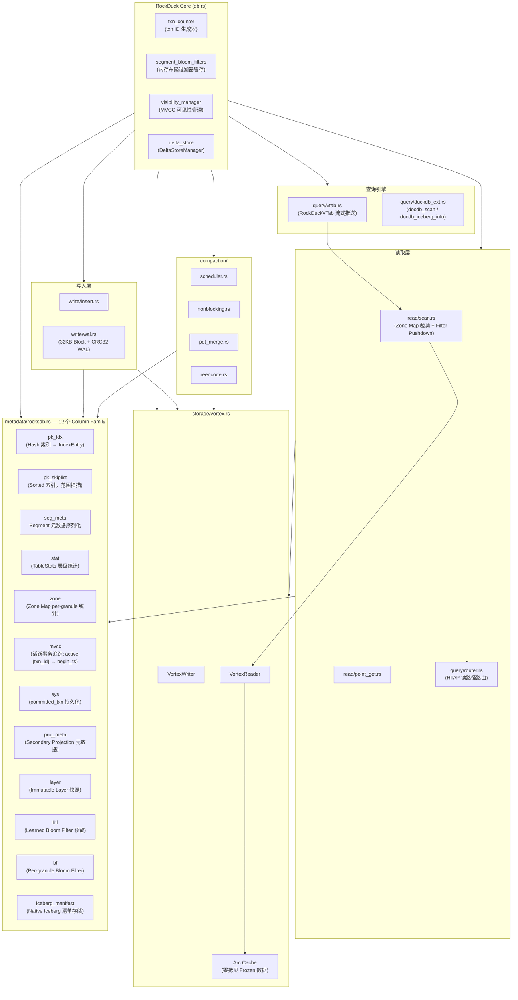
```mermaid
flowchart TB
    subgraph Core["RockDuck Core (db.rs)"]
        txn["txn_counter\n(txn ID 生成器)"]
        wal_cache["segment_bloom_filters\n(内存布隆过滤器缓存)"]
        mvcc_mgr["visibility_manager\n(MVCC 可见性管理)"]
        delta_mgr["delta_store\n(DeltaStoreManager)"]
    end

    subgraph Write["写入层"]
        insert["write/insert.rs"]
        wal["write/wal.rs\n(32KB Block + CRC32 WAL)"]
    end

    subgraph Read["读取层"]
        scan["read/scan.rs\n(Zone Map 裁剪 + Filter Pushdown)"]
        point_get["read/point_get.rs"]
        router["query/router.rs\n(HTAP 读路径路由)"]
    end

    subgraph Storage["storage/vortex.rs"]
        writer["VortexWriter"]
        reader["VortexReader"]
        mmap_cache["Arc<Mmap> Cache\n(零拷贝 Frozen 数据)"]
    end

    subgraph Metadata["metadata/rocksdb.rs — 12 个 Column Family"]
        pk_idx["pk_idx\n(Hash 索引 → IndexEntry)"]
        pk_skip["pk_skiplist\n(Sorted 索引，范围扫描)"]
        seg_meta["seg_meta\nSegment 元数据序列化"]
        stat["stat\n(TableStats 表级统计)"]
        zone["zone\n(Zone Map per-granule 统计)"]
        mvcc_cf["mvcc\n(活跃事务追踪: active:{txn_id} → begin_ts)"]
        sys["sys\n(committed_txn 持久化)"]
        proj["proj_meta\n(Secondary Projection 元数据)"]
        layer["layer\n(Immutable Layer 快照)"]
        lbf["lbf\n(Learned Bloom Filter 预留)"]
        bf["bf\n(Per-granule Bloom Filter)"]
        iceberg_cf["iceberg_manifest\n(Native Iceberg 清单存储)"]
    end

    subgraph Query["查询引擎"]
        vtab["query/vtab.rs\n(RockDuckVTab 流式推送)"]
        duckdb_fn["query/duckdb_ext.rs\n(docdb_scan / docdb_iceberg_info)"]
    end

    subgraph Compaction["compaction/"]
        scheduler["scheduler.rs"]
        nonblocking["nonblocking.rs"]
        pdt_merge["pdt_merge.rs"]
        reencode["reencode.rs"]
    end

    Core --> Write
    Core --> Read
    Core --> Storage
    Core --> Metadata
    Core --> Query
    Core --> Compaction

    Write --> Storage
    Write --> Metadata
    Read --> Metadata
    Read --> Storage
    Read --> router
    scan --> reader
    reader --> mmap_cache
    vtab --> scan
    Compaction --> Storage
    Compaction --> Metadata
```


### 数据目录结构

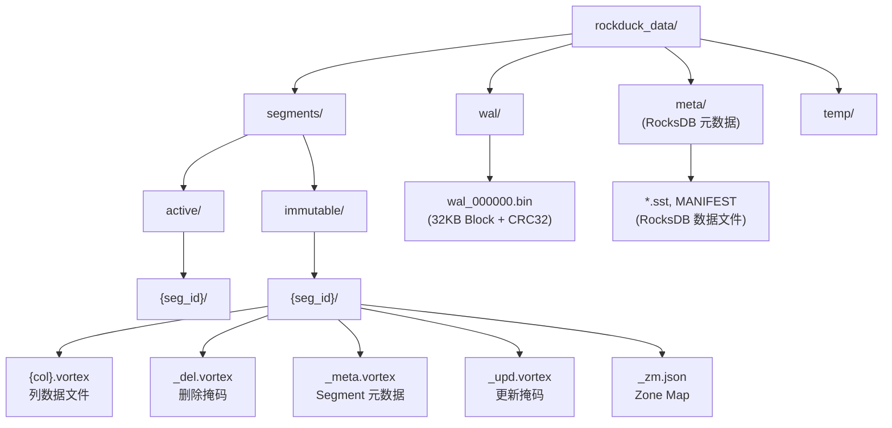
```mermaid
graph TD
    root["rockduck_data/"]
    root --> meta["meta/\n(RocksDB 元数据)"]
    root --> segments["segments/"]
    root --> wal["wal/"]
    root --> temp["temp/"]

    segments --> active["active/"]
    segments --> immutable["immutable/"]

    active --> seg_active["{seg_id}/"]
    immutable --> seg_imm["{seg_id}/"]

    seg_imm --> col_vortex["{col}.vortex\n列数据文件"]
    seg_imm --> del_vortex["_del.vortex\n删除掩码"]
    seg_imm --> meta_vortex["_meta.vortex\nSegment 元数据"]
    seg_imm --> upd_vortex["_upd.vortex\n更新掩码"]
    seg_imm --> zm_vortex["_zm.json\nZone Map"]

    wal --> wal_file["wal_000000.bin\n(32KB Block + CRC32)"]

    meta --> rocksdb_sst["*.sst, MANIFEST\n(RocksDB 数据文件)"]
```


---

## 存储层次

RockDuck 的数据组织为 **Segment → Granule → Block** 三层结构，灵感来自 ClickHouse MergeTree。

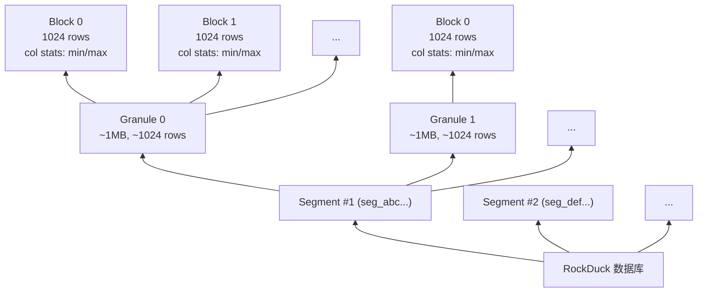
```mermaid
graph BT
    DB["RockDuck 数据库"]
    DB --> Seg1["Segment #1 (seg_abc...)"]
    DB --> Seg2["Segment #2 (seg_def...)"]
    DB --> SegN["..."]

    Seg1 --> G1_1["Granule 0\n~1MB, ~1024 rows"]
    Seg1 --> G1_2["Granule 1\n~1MB, ~1024 rows"]
    Seg1 --> G1_M["..."]

    G1_1 --> B1_1["Block 0\n1024 rows\ncol stats: min/max"]
    G1_1 --> B1_2["Block 1\n1024 rows\ncol stats: min/max"]
    G1_1 --> B1_K["..."]

    G1_2 --> B2_1["Block 0\n1024 rows\ncol stats: min/max"]
```


### Segment 生命周期

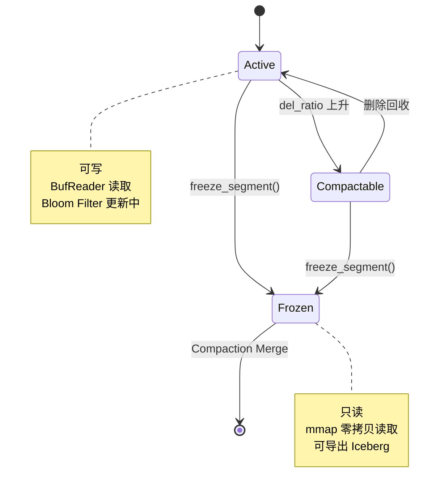
```mermaid
stateDiagram-v2
    [*] --> Active
    Active --> Compactable : del_ratio 上升
    Active --> Frozen : freeze_segment()
    Compactable --> Active : 删除回收
    Compactable --> Frozen : freeze_segment()
    Frozen --> [*] : Compaction Merge

    note right of Active
        可写
        BufReader 读取
        Bloom Filter 更新中
    end note

    note right of Frozen
        只读
        mmap 零拷贝读取
        可导出 Iceberg
    end note
```


### 数据类型与默认编码

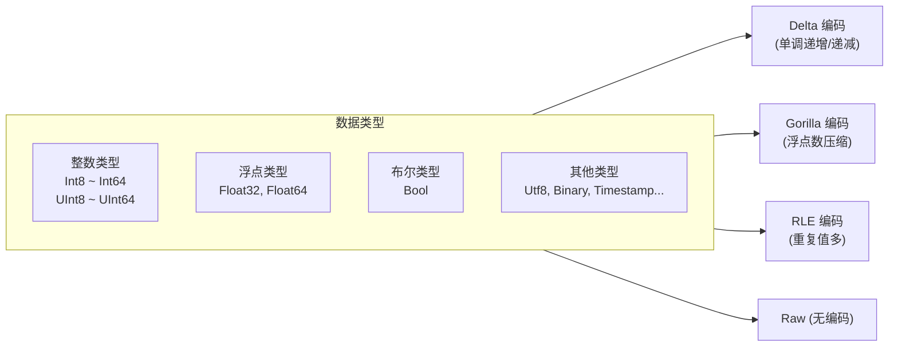
```mermaid
flowchart LR
    subgraph Types["数据类型"]
        direction TB
        Ints["整数类型\nInt8 ~ Int64\nUInt8 ~ UInt64"]
        Floats["浮点类型\nFloat32, Float64"]
        Bools["布尔类型\nBool"]
        Others["其他类型\nUtf8, Binary, Timestamp..."]
    end

    Types --> Delta["Delta 编码\n(单调递增/递减)"]
    Types --> Gorilla["Gorilla 编码\n(浮点数压缩)"]
    Types --> RLE["RLE 编码\n(重复值多)"]
    Types --> Raw["Raw (无编码)"]
```


---

## MVCC 与 Time-Travel

### MVCC 设计（Shadow Column 方式）

每个数据行记录两个事务 ID：

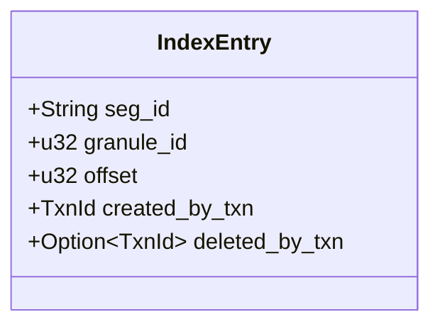
```mermaid
classDiagram
    class IndexEntry {
        +String seg_id
        +u32 granule_id
        +u32 offset
        +TxnId created_by_txn
        +Option~TxnId~ deleted_by_txn
    }
```


### 可见性判断

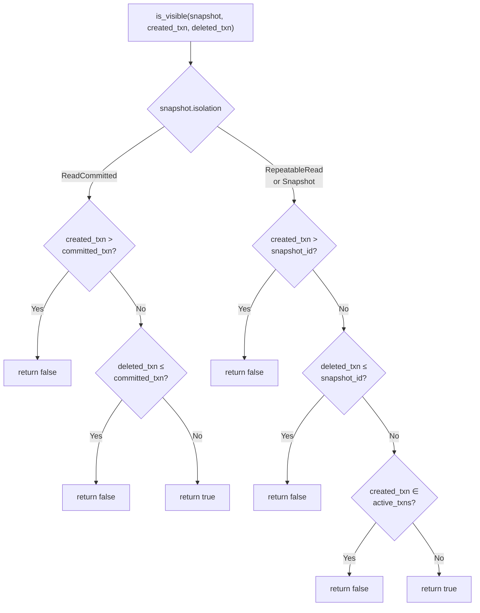
```mermaid
flowchart TD
    START["is_visible(snapshot, created_txn, deleted_txn)"]
    START --> ISO{"snapshot.isolation"}

    ISO -->|"ReadCommitted"| RC1{"created_txn >\ncommitted_txn?"}
    RC1 -->|Yes| RC_FALSE["return false"]
    RC1 -->|No| RC2{"deleted_txn ≤\ncommitted_txn?"}
    RC2 -->|Yes| RC_FALSE2["return false"]
    RC2 -->|No| RC_TRUE["return true"]

    ISO -->|"RepeatableRead\nor Snapshot"| RR1{"created_txn >\nsnapshot_id?"}
    RR1 -->|Yes| RR_FALSE1["return false"]
    RR1 -->|No| RR2{"deleted_txn ≤\nsnapshot_id?"}
    RR2 -->|Yes| RR_FALSE2["return false"]
    RR2 -->|No| RR3{"created_txn ∈\nactive_txns?"}
    RR3 -->|Yes| RR_FALSE3["return false"]
    RR3 -->|No| RR_TRUE["return true"]
```


### Time-Travel 查询

```rust
// 在 TxnId = 10 的时间点查询数据
let snapshot = db.snapshot_at(10, IsolationLevel::Snapshot)?;
let results = db.scan_as_of("users", 10, pk_range, filter)?;
```

### MVCC RocksDB 存储 — 12 个 Column Family

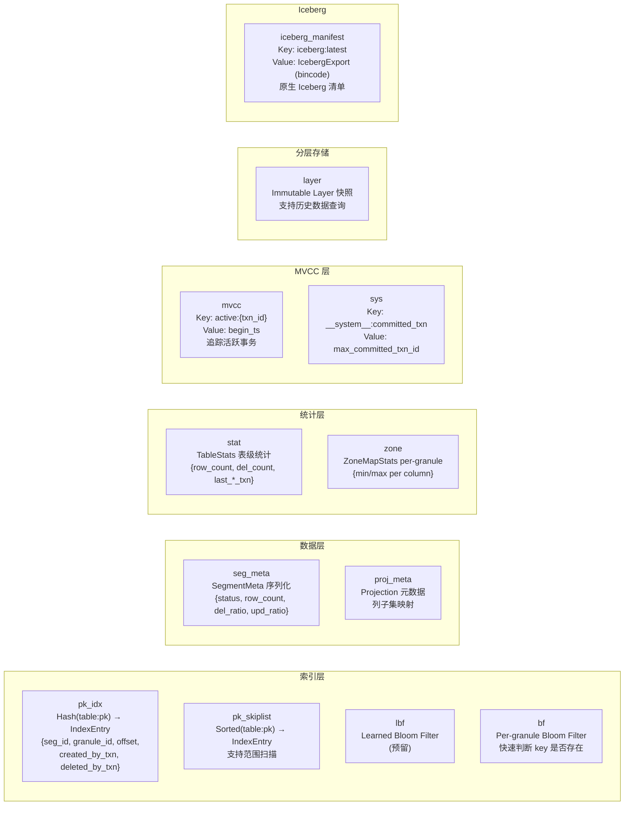
```mermaid
graph LR
    subgraph CF_Index["索引层"]
        direction TB
        pk_idx["pk_idx\nHash(table:pk) → IndexEntry\n{seg_id, granule_id, offset,\ncreated_by_txn, deleted_by_txn}"]
        pk_skip["pk_skiplist\nSorted(table:pk) → IndexEntry\n支持范围扫描"]
        lbf["lbf\nLearned Bloom Filter\n(预留)"]
        bf["bf\nPer-granule Bloom Filter\n快速判断 key 是否存在"]
    end

    subgraph CF_Data["数据层"]
        direction TB
        seg_meta["seg_meta\nSegmentMeta 序列化\n{status, row_count, del_ratio, upd_ratio}"]
        proj_meta["proj_meta\nProjection 元数据\n列子集映射"]
    end

    subgraph CF_Stats["统计层"]
        direction TB
        stat["stat\nTableStats 表级统计\n{row_count, del_count, last_*_txn}"]
        zone["zone\nZoneMapStats per-granule\n{min/max per column}"]
    end

    subgraph CF_MVCC["MVCC 层"]
        direction TB
        mvcc_cf["mvcc\nKey: active:{txn_id}\nValue: begin_ts\n追踪活跃事务"]
        sys["sys\nKey: __system__:committed_txn\nValue: max_committed_txn_id"]
    end

    subgraph CF_Layer["分层存储"]
        direction TB
        layer["layer\nImmutable Layer 快照\n支持历史数据查询"]
    end

    subgraph CF_Iceberg["Iceberg"]
        direction TB
        iceberg["iceberg_manifest\nKey: iceberg:latest\nValue: IcebergExport (bincode)\n原生 Iceberg 清单"]
    end
```

**索引双写策略**：每条 Insert 同时写入 `pk_idx`（O(1) 点查）和 `pk_skiplist`（O(log n) 范围扫描），牺牲写入性能换取读取灵活性。

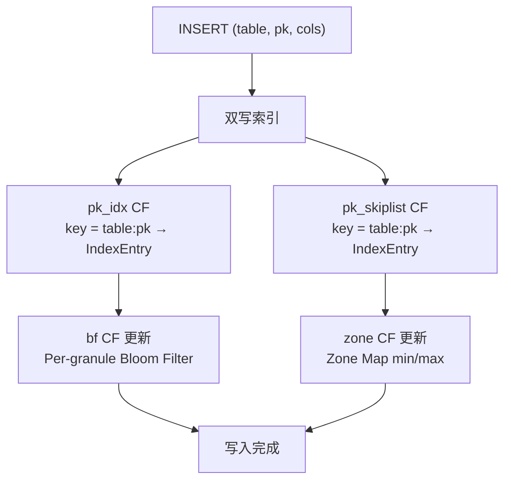
```mermaid
graph TD
    INSERT["INSERT (table, pk, cols)"] --> IDX["双写索引"]
    IDX --> H["pk_idx CF\nkey = table:pk → IndexEntry"]
    IDX --> S["pk_skiplist CF\nkey = table:pk → IndexEntry"]

    H --> BF_U["bf CF 更新\nPer-granule Bloom Filter"]
    S --> ZM_U["zone CF 更新\nZone Map min/max"]

    BF_U --> DONE["写入完成"]
    ZM_U --> DONE
```

---

## 自适应删除掩码

DelMask 根据删除率自动选择最优存储格式，触发模式切换：

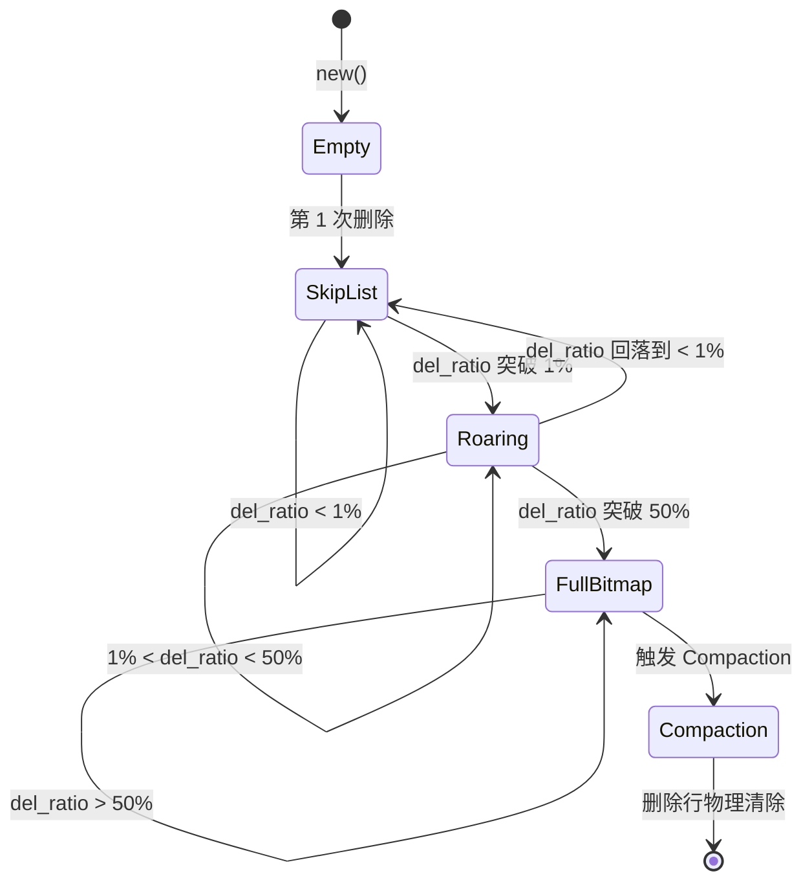
```mermaid
stateDiagram-v2
    [*] --> Empty : new()
    Empty --> SkipList : 第 1 次删除
    SkipList --> SkipList : del_ratio < 1%
    SkipList --> Roaring : del_ratio 突破 1%

    Roaring --> Roaring : 1% < del_ratio < 50%
    Roaring --> FullBitmap : del_ratio 突破 50%
    Roaring --> SkipList : del_ratio 回落到 < 1%

    FullBitmap --> FullBitmap : del_ratio > 50%
    FullBitmap --> Compaction : 触发 Compaction

    Compaction --> [*] : 删除行物理清除
```


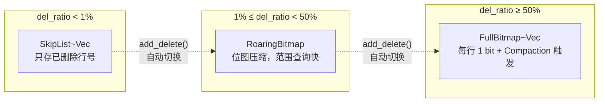
```mermaid
graph LR
    subgraph Threshold1["del_ratio < 1%"]
        DS1["SkipList~Vec<u32>\n只存已删除行号"]
    end

    subgraph Threshold2["1% ≤ del_ratio < 50%"]
        DS2["RoaringBitmap\n位图压缩，范围查询快"]
    end

    subgraph Threshold3["del_ratio ≥ 50%"]
        DS3["FullBitmap~Vec<u8>\n每行 1 bit + Compaction 触发"]
    end

    DS1 -.->|"add_delete()\n自动切换"| DS2
    DS2 -.->|"add_delete()\n自动切换"| DS3
```


---

## 自适应列编码

`AdaptiveEncoder` 分析真实数据特征，推荐最优编码方案：

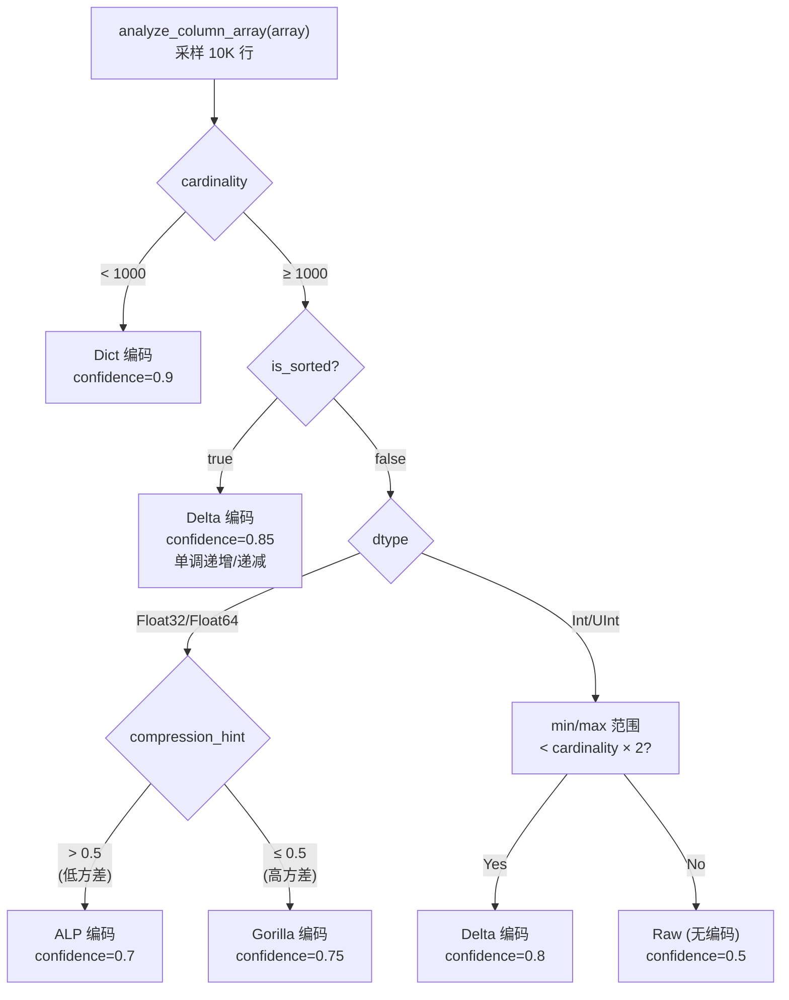
```mermaid
flowchart TD
    START["analyze_column_array(array)\n采样 10K 行"] --> CARD{"cardinality"}

    CARD -->|"< 1000"| LOW_CARD["Dict 编码\nconfidence=0.9"]
    CARD -->|"≥ 1000"| SORTED{"is_sorted?"}

    SORTED -->|"true"| DELTA_SORT["Delta 编码\nconfidence=0.85\n单调递增/递减"]
    SORTED -->|"false"| DTYPE{"dtype"}

    DTYPE -->|"Float32/Float64"| FLOAT{"compression_hint"}
    FLOAT -->|"> 0.5\n(低方差)"| ALP["ALP 编码\nconfidence=0.7"]
    FLOAT -->|"≤ 0.5\n(高方差)"| GORILLA["Gorilla 编码\nconfidence=0.75"]

    DTYPE -->|"Int/UInt"| RANGE["min/max 范围\n< cardinality × 2?"]
    RANGE -->|Yes| DELTA_RANGE["Delta 编码\nconfidence=0.8"]
    RANGE -->|No| RAW["Raw (无编码)\nconfidence=0.5"]
```


### Block 级统计信息

每 1024 行为一个 Block，记录热点列的 min/max，用于 granule 内谓词下推：

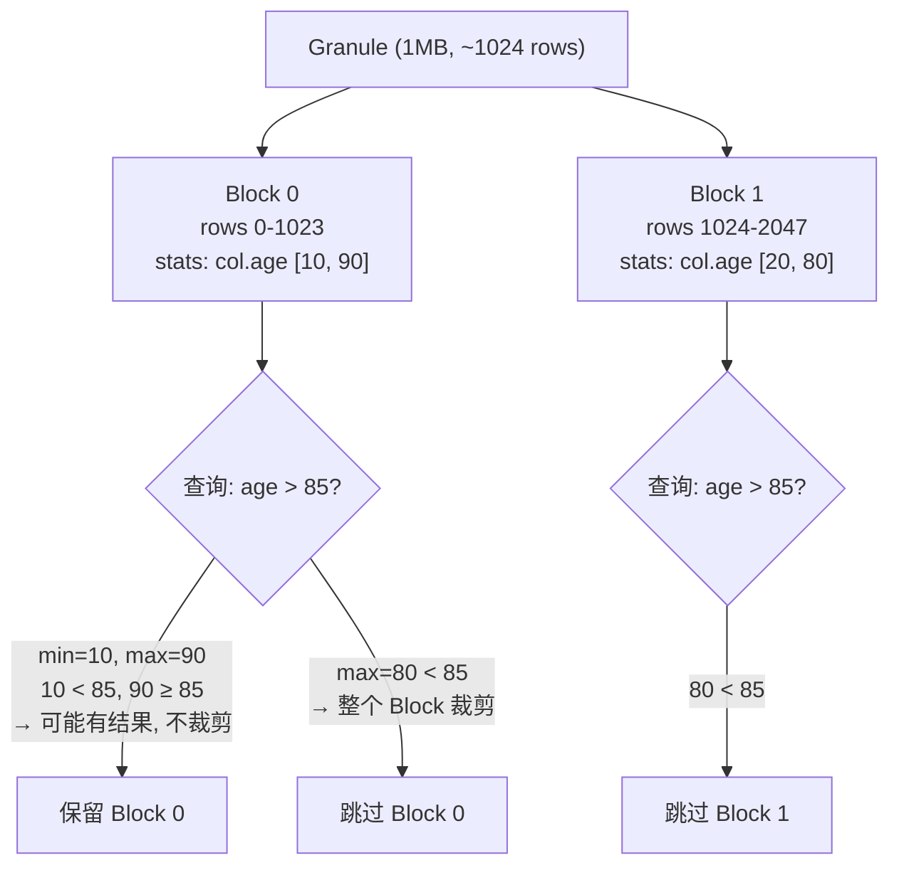
```mermaid
graph TB
    G["Granule (1MB, ~1024 rows)"]
    G --> B1["Block 0\nrows 0-1023\nstats: col.age [10, 90]"]
    G --> B2["Block 1\nrows 1024-2047\nstats: col.age [20, 80]"]

    B1 --> Q1{"查询: age > 85?"}
    Q1 -->|"min=10, max=90\n10 < 85, 90 ≥ 85\n→ 可能有结果, 不裁剪"| KEEP1["保留 Block 0"]
    Q1 -->|"max=80 < 85\n→ 整个 Block 裁剪"| SKIP1["跳过 Block 0"]

    B2 --> Q2{"查询: age > 85?"}
    Q2 -->|80 < 85| SKIP2["跳过 Block 1"]
```


---

## HTAP 双存储路由

### ReadPath 决策树

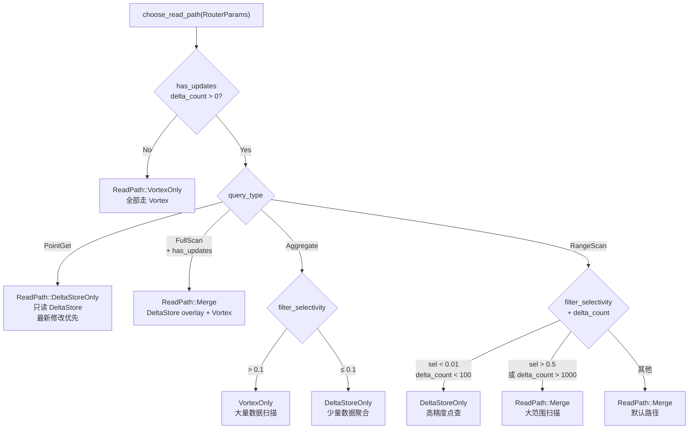
```mermaid
flowchart TD
    START["choose_read_path(RouterParams)"] --> UPDATES{"has_updates\ndelta_count > 0?"}
    UPDATES -->|No| VX["ReadPath::VortexOnly\n全部走 Vortex"]

    UPDATES -->|Yes| QTYPE{"query_type"}

    QTYPE -->|"PointGet"| DSO["ReadPath::DeltaStoreOnly\n只读 DeltaStore\n最新修改优先"]

    QTYPE -->|"FullScan\n+ has_updates"| MERGE["ReadPath::Merge\nDeltaStore overlay + Vortex"]

    QTYPE -->|"Aggregate"| SEL{"filter_selectivity"}
    SEL -->|"> 0.1"| VX_A["VortexOnly\n大量数据扫描"]
    SEL -->|"≤ 0.1"| DSO_A["DeltaStoreOnly\n少量数据聚合"]

    QTYPE -->|"RangeScan"| SEL_R{"filter_selectivity\n+ delta_count"}

    SEL_R -->|"sel < 0.01\ndelta_count < 100"| DSO_R["DeltaStoreOnly\n高精度点查"]

    SEL_R -->|"sel > 0.5\n或 delta_count > 1000"| MERGE_R["ReadPath::Merge\n大范围扫描"]

    SEL_R -->|其他| MERGE_D["ReadPath::Merge\n默认路径"]
```


### DeltaStore 数据结构

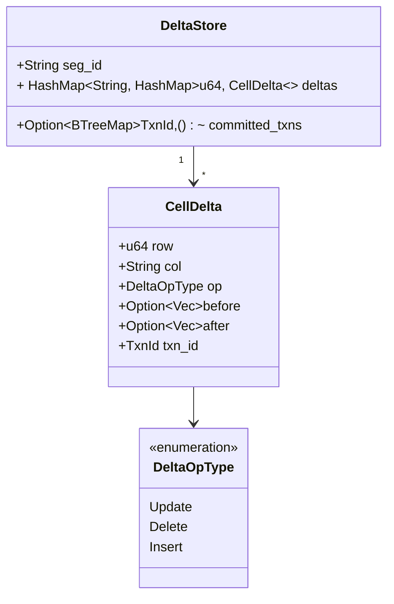
```mermaid
classDiagram
    class DeltaStore {
        +String seg_id
        +BTreeMap~TxnId, HashMap~String, HashMap~u64, CellDelta~~ deltas
        +Option~BTreeMap~TxnId, ()~ committed_txns
    }

    class CellDelta {
        +u64 row
        +String col
        +DeltaOpType op
        +Option~Vec~before
        +Option~Vec~after
        +TxnId txn_id
    }

    class DeltaOpType {
        <<enumeration>>
        Update
        Delete
        Insert
    }

    DeltaStore "1" --> "*" CellDelta
    CellDelta --> DeltaOpType
```


### DeltaStore overlay 合并过程

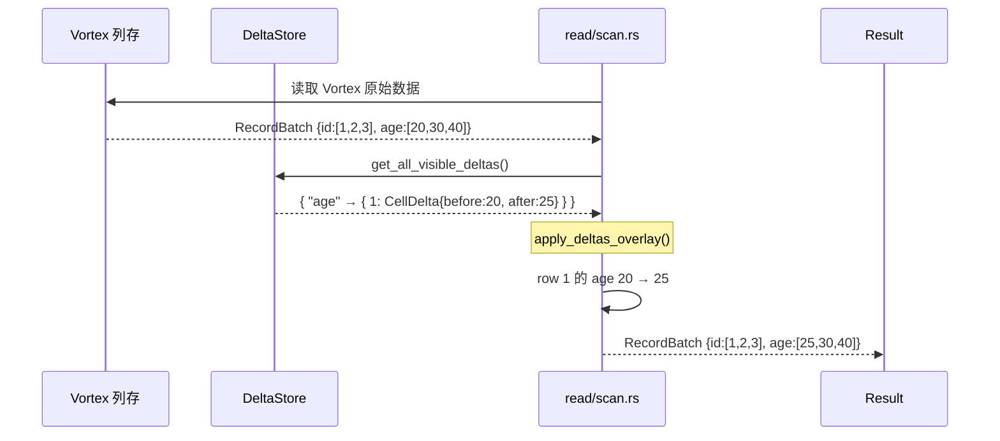
```mermaid
sequenceDiagram
    participant Vx as Vortex 列存
    participant DS as DeltaStore
    participant Scan as read/scan.rs

    Scan->>Vx: 读取 Vortex 原始数据
    Vx-->>Scan: RecordBatch {id:[1,2,3], age:[20,30,40]}

    Scan->>DS: get_all_visible_deltas()
    DS-->>Scan: { "age" → { 1: CellDelta{before:20, after:25} } }

    Note over Scan: apply_deltas_overlay()
    Scan->>Scan: row 1 的 age 20 → 25

    Scan-->>Result: RecordBatch {id:[1,2,3], age:[25,30,40]}
```


---

## 写入路径

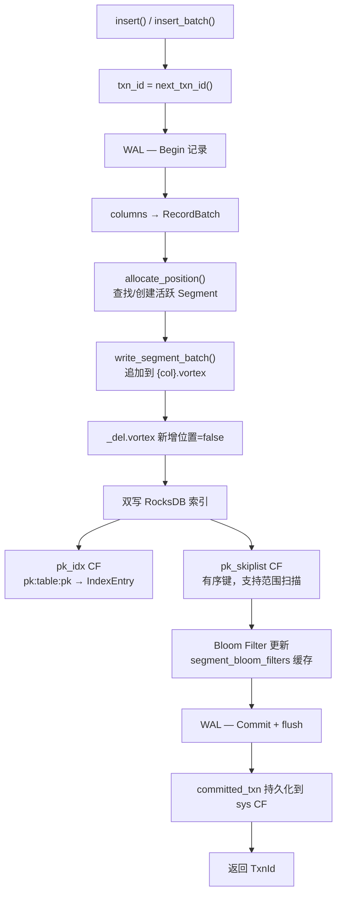
```mermaid
flowchart TD
    A["insert() / insert_batch()"] --> B["txn_id = next_txn_id()"]
    B --> C["WAL — Begin 记录"]
    C --> D["columns → RecordBatch"]
    D --> E["allocate_position()\n查找/创建活跃 Segment"]

    E --> F["write_segment_batch()\n追加到 {col}.vortex"]
    F --> G["_del.vortex 新增位置=false"]
    G --> H["双写 RocksDB 索引"]

    H --> H1["pk_idx CF\npk:table:pk → IndexEntry"]
    H --> H2["pk_skiplist CF\n有序键，支持范围扫描"]

    H2 --> I["Bloom Filter 更新\nsegment_bloom_filters 缓存"]
    I --> J["WAL — Commit + flush"]
    J --> K["committed_txn 持久化到 sys CF"]
    K --> L["返回 TxnId"]
```


### WAL Block 格式

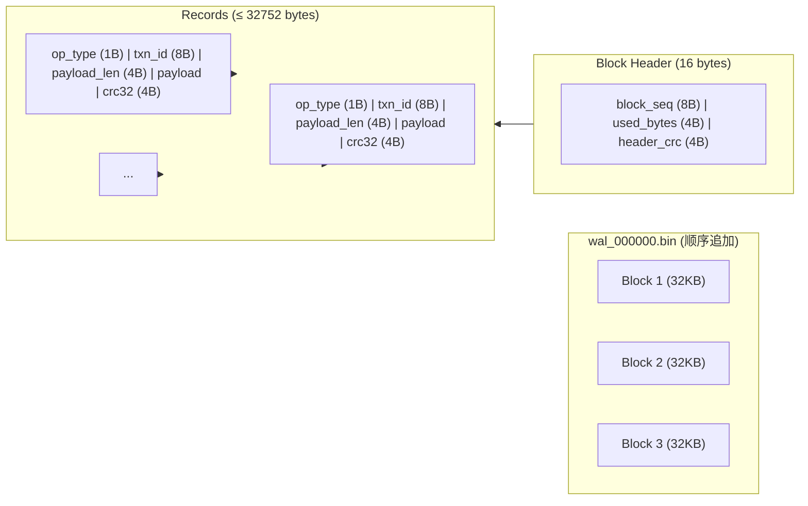
```mermaid
graph RL
    subgraph WAL_File["wal_000000.bin (顺序追加)"]
        direction RL
        B1["Block 1 (32KB)"]
        B2["Block 2 (32KB)"]
        B3["Block 3 (32KB)"]
    end

    subgraph Block_N["Block Header (16 bytes)"]
        HDR["block_seq (8B) | used_bytes (4B) | header_crc (4B)"]
    end

    subgraph Records["Records (≤ 32752 bytes)"]
        R1["op_type (1B) | txn_id (8B) | payload_len (4B) | payload | crc32 (4B)"]
        R2["op_type (1B) | txn_id (8B) | payload_len (4B) | payload | crc32 (4B)"]
        R3["..."]
    end

    Block_N --> Records
    Records --> R1
    Records --> R2
    Records --> R3
```


### WAL 崩溃恢复流程

```mermaid
flowchart LR
    START["RockDuck 启动"] --> RECOVER["recover_from_wal()"]
    RECOVER --> LIST["list_wal_files()\n扫描 wal_*.bin"]
    LIST --> SCAN["scan_committed_records()"]
    SCAN --> FSM["重建事务状态机"]

    FSM --> T1["Begin / Insert / Delete / Update"]
    T1 --> COMMIT{"OpType == Commit?"}
    T1 --> ROLLBACK{"OpType == Rollback?"}

    COMMIT -->|"收集该 txn 的所有记录"| COMMIT_COLLECT
    ROLLBACK -->|"丢弃该 txn 的所有记录"| ROLLBACK_DROP

    COMMIT_COLLECT --> REPLAY["重放到 RocksDB\npk_idx + pk_skiplist"]
    ROLLBACK_DROP --> DONE["忽略"]
    REPLAY --> DONE

    DONE --> MAX["max_committed_txn 更新"]
```


---

## 读取路径

```mermaid
flowchart TD
    A["get(pk) / scan(pk_range, filter)"] --> BF["Bloom Filter 检查\n快速跳过不存在的 PK"]
    A --> ZM["Zone Map 裁剪\n跳过不包含查询值的数据块"]
    A --> BK["Block Stats 裁剪\nGranule 内谓词下推"]

    BF --> IDX["RocksDB pk_idx 查找\n→ IndexEntry\n{seg_id, granule_id, offset}"]
    ZM --> IDX
    BK --> IDX

    IDX --> STATUS{"Segment 状态"}

    STATUS -->|"Active / Compactable"| BUF["BufReader 读取\n_arrow-ipc FileReader_"]
    STATUS -->|"Frozen"| MMAP["mmap 零拷贝\nArc<Mmap> 缓存共享"]

    BUF --> MVCC["MVCC 可见性过滤\nis_visible(snapshot, ...)"]
    MMAP --> MVCC

    MVCC --> DM["Del Mask 应用\n已删除行过滤"]
    DM --> FILT["Filter 表达式求值\nArrow compute filter"]
    FILT --> RB["RecordBatch 返回"]
```


### Vortex 文件布局

```mermaid
graph TD
    subgraph Segment["segments/{seg_id}/"]
        direction TB
        META["_meta.vortex\nSegment 元数据\nSegmentMeta (bincode)"]
        DEL["_del.vortex\n删除掩码\nBooleanArray"]

        COL1["{col1}.vortex\nArrow IPC 列文件"]
        COL2["{col2}.vortex\nArrow IPC 列文件"]
        COLN["..."]

        UPD["_upd_age.vortex\n更新掩码"]
        ZM["_zm.json\nZone Map"]
    end

    subgraph VortexReader["VortexReader"]
        READER["read_column(seg_id, col)\n自动选择读取路径"]
        READER --> META_CHECK{"meta.status"}
        META_CHECK -->|Frozen| MMAP_READ["read_column_mmap_internal()"]
        META_CHECK -->|Active| BUF_READ["read_arrow_file()"]
        MMAP_READ --> ARC_CACHE["Arc<Mmap> 缓存"]
    end

    VortexReader --> COL1
    VortexReader --> COL2
    VortexReader --> DEL
```


### Filter 表达式解析与求值

`filter_expr.rs` 实现了一个手写的表达式解析器，不依赖外部 SQL 解析库：

```mermaid
flowchart TD
    RAW["WHERE age > 30 AND name = 'Alice' OR NOT deleted"]
    RAW --> TOKEN["Tokenizer"]
    TOKEN --> PARSE["Recursive Descent Parser"]
    PARSE --> AST["Expr AST"]
    AST --> EVAL["evaluate(batch, &Expr) → BooleanArray"]

    subgraph AST["Expr AST"]
        OR["Or"]
        AND1["And"]
        GT["Compare(age > 30)"]
        EQ["Compare(name = 'Alice')"]
        NOT_DEL["Not"]
        DEL["Compare(deleted = true)"]
        OR --> AND1
        OR --> NOT_DEL
        AND1 --> GT
        AND1 --> EQ
        NOT_DEL --> DEL
    end

    EVAL --> MASK["BooleanMask → Arrow Compute Filter"]
```

**支持的操作符**：

| 类别 | 操作符 |
| --- | --- |
| 比较 | `>`, `>=`, `<`, `<=`, `=`, `!=` |
| 逻辑 | `AND`, `OR`, `NOT` |
| 括号 | `(`, `)` |
| 字面量 | 整数、浮点、字符串、布尔 |

**求值策略**：先序遍历 AST，短路求值（遇到 `false AND ...` 直接返回，跳过后续列读取）。

---

## Compaction 调度

### 优先级队列与评分公式

```mermaid
flowchart LR
    subgraph Evaluate["evaluate() — 遍历所有 Segment"]
        direction TB
        E1["读取 SegmentMeta"]
        E1 --> SCORE["calculate_priority()"]
        SCORE --> REASON["determine_reason()"]
    end

    SCORE -->|"del_score = del_ratio² × 10\n+ size_score = log₂(MB) × 0.5\n+ age_score = log₂(hours) × 0.3"| FORMULA["priority = del_score\n  + size_score\n  + age_score"]
    FORMULA --> PUSH["BinaryHeap.push()\n优先级队列"]
```


### Compaction 原因判定

```mermaid
flowchart TD
    M["SegmentMeta"] --> DEL{"del_ratio > 0.5?"}
    DEL -->|Yes| HDR["CompactionReason::HighDeleteRatio"]
    DEL -->|No| SIZE{"size < 1MB?"}
    SIZE -->|Yes| SF["CompactionReason::SmallFile"]
    SIZE -->|No| UPD{"upd_ratio > 0.3\n且 del_ratio < 0.5?"}
    UPD -->|Yes| INC["CompactionReason::IncrementalMaterialize"]
    UPD -->|No| PER["CompactionReason::Periodic"]
```


### Feature 5: 查询反馈增强的 Compaction 优先级

```mermaid
flowchart TD
    BASE["base_score\n= del²×10 + size×0.5 + age×0.3"] --> FEEDBACK

    subgraph FEEDBACK["Query Feedback 惩罚"]
        STALE["Zone Map 失准\nstaleness_penalty × 5.0"]
        MISS["裁剪失效\n(1 - prune_hit_ratio) × 3.0"]
    end

    BASE --> PEN1["+ staleness_penalty"]
    PEN1 --> PEN2["+ miss_penalty"]
    PEN2 --> FINAL["final_priority\n用于 BinaryHeap 排序"]
```


---

## PDT Merge Compaction

### 位置删除（PDT）原理

传统 Compaction 比较 key 值再决定去留。PDT（Positional Delete Tracking）只处理位置变化，不比较数据：

```mermaid
graph LR
    subgraph Old["旧 Segment"]
        O1["位置 0: alive"]
        O2["位置 1: deleted ✗"]
        O3["位置 2: alive"]
        O4["位置 3: deleted ✗"]
        O5["位置 4: alive"]
    end

    subgraph PDT["PDT Merge"]
        DM["DelMask\nSkipList / RoaringBitmap"]
    end

    subgraph New["新 Segment"]
        N1["位置 0: row0 的值"]
        N2["位置 1: row2 的值 ← 跳过 deleted"]
        N3["位置 2: row4 的值 ← 跳过 deleted"]
    end

    Old -->|读取 DelMask| PDT
    PDT -->|存活位置列表| New
```

**核心收益**：I/O 量 = 有效数据量，而非总数据量。

### 多路合并

```mermaid
flowchart LR
    S1["Segment A\n(del_ratio=60%)"] --> M["PDT multiway_merge()"]
    S2["Segment B\n(del_ratio=55%)"] --> M
    S3["Segment C\n(del_ratio=70%)"] --> M
    M --> OUT["新 Segment\n(del_ratio=0%)"]
```

---

## Query Feedback — 自适应 Compaction

### 工作原理

`QueryFeedbackCollector` 追踪 Zone Map 裁剪命中率，影响 Compaction 优先级：

```mermaid
flowchart TD
    Q["查询 SELECT * WHERE age > 30"]

    Q --> ZM["Zone Map 估算\nGranule 0-9 全部可能包含"]
    ZM --> COMPARE{"实际匹配 Granule 数"}

    COMPARE -->|估算 10，实际 8+| HIT["prune_hit\nstaleness_penalty -= 0.05"]
    COMPARE -->|估算 10，实际 1| MISS["prune_miss\nstaleness_penalty += 0.1\nmiss_penalty += 3.0"]

    HIT --> PRIORITY["优先级分数"]
    MISS --> PRIORITY
    PRIORITY --> HEAP["CompactionHeap"]
```

### staleness_penalty 与 prune_hit_ratio

| 状态 | staleness_penalty | prune_hit_ratio |
| --- | --- | --- |
| 从未查询 | 0.0 | 0.5（中立） |
| 多次 miss | → 1.0（封顶） | → 0.0 |
| 多次 hit | → 0.0（下限） | → 1.0 |

惩罚分数加入 Compaction 优先级：`priority += staleness_penalty × 5.0 + (1 - prune_hit_ratio) × 3.0`

---

## Iceberg v2 导出

### 双层设计

```mermaid
flowchart LR
    subgraph Hot["热路径 (Native in-RocksDB)"]
        direction TB
        H1["IcebergExport\n(bincode 序列化)"]
        H2["CF: iceberg_manifest\nKey: iceberg:latest"]
        H3["freeze_segment()\n自动更新清单"]
    end

    subgraph Cold["冷路径 (On-Demand Spec-Compliant)"]
        direction TB
        C1["export_to_iceberg()"]
        C2["v{N}.metadata.json\n(TableMetadata)"]
        C3["snap-*.avro\n(Manifest List)"]
        C4["*-m0.avro\n(Manifest)"]
        C5["data/segments/"]
    end

    Hot -->|"freeze_for_iceberg()"| Cold
```


### Iceberg 导出目录结构

```mermaid
graph TD
    root["target/ (Iceberg Table Root)"]
    root --> vh["version-hint.txt\n\"2\""]
    root --> meta["metadata/"]
    root --> data["data/"]

    meta --> vm["v{snapshot_id}.metadata.json"]
    meta --> ml["snap-{id}-{seq}-{uuid}.avro\n(Manifest List)"]
    meta --> vh2["version-hint.txt\n\"2\""]

    data --> segs["segments/"]
    segs --> s1["{seg_id}/"]
    segs --> s2["{seg_id}/"]

    s1 --> c1["{col1}.vortex\n(Vortex 数据文件)"]
    s1 --> c2["{col2}.vortex"]
    s1 --> dm["_del.vortex"]
    s1 --> m_["_meta.vortex"]
```


### Iceberg 导出流程

```mermaid
flowchart TD
    START["export_to_iceberg()"] --> COLLECT["收集所有 Frozen segments"]
    COLLECT --> FIELDS["提取 field_id_map\ncol → Iceberg field_id"]
    FIELDS --> ENTRIES["translate::\nbuild_data_file_entries()"]
    ENTRIES --> MANIFEST["加载/创建 IcebergExport"]
    MANIFEST --> DIRS["创建目录结构\n(metadata/, data/)"]
    DIRS --> COPY["复制 Vortex 文件到 data/"]
    COPY --> SCHEMA["translate::to_iceberg_schema()"]
    SCHEMA --> AVRO_M["write_manifest_avro_sync()"]
    AVRO_M --> AVRO_ML["write_manifest_list_avro_sync()"]
    AVRO_ML --> JSON["write TableMetadata JSON"]
    JSON --> FSYNC["sync_file() / sync_dir()\n(Windows: FlushFileBuffers)"]
    FSYNC --> SAVE["save_manifest() → RocksDB"]
    SAVE --> DONE["返回 metadata_path"]
```


### RocksDB Iceberg Manifest 存储

```mermaid
graph LR
    subgraph iceberg_manifest_CF["iceberg_manifest Column Family"]
        K1["iceberg:latest\n→ IcebergExport (bincode)"]
        K2["iceberg:history\n→ Vec<SnapshotRef> (bincode)"]
    end

    subgraph SnapshotRef["SnapshotRef"]
        SR1["name: \"main\""]
        SR2["snapshot_id: 12345"]
        SR3["type_: \"branch\""]
    end

    K1 --> IcebergExport["IcebergExport\nsnapshot_id, sequence_number\nentries: Vec<DataFileEntry>"]
    IcebergExport --> DFE["DataFileEntry\nfile_path, record_count\nlower_bounds, upper_bounds\nnull_counts, split_offsets"]
```


### DataFileEntry 结构

```mermaid
classDiagram
    class DataFileEntry {
        +String file_path
        +String file_format = "VORTEX"
        +u64 record_count
        +u64 file_size
        +HashMap~i32, Vec~u8~~ lower_bounds
        +HashMap~i32, Vec~u8~~ upper_bounds
        +HashMap~i32, u64~ null_counts
        +Vec~u64~ split_offsets
        +i32 sort_order_id = 1
    }
```


---

## DuckDB 集成

### 自定义 VTab 流式推送

DuckDB 自带的 `ArrowVTab` 会将所有 RecordBatch concat 成一个巨大批次，RockDuck 实现了自定义 `RockDuckVTab`：

```mermaid
sequenceDiagram
    participant DuckDB as DuckDB 查询引擎
    participant VTab as RockDuckVTab

    Note over DuckDB,VTab: bind() 阶段（一次性）
    DuckDB->>VTab: bind(path)
    VTab->>RockDuck: RockDuck::open(path)
    VTab->>VTab: scan("default")
    VTab-->>DuckDB: 注册 schema 列 + cardinality

    Note over DuckDB,VTab: init() 阶段（一次性）
    DuckDB->>VTab: init()
    VTab-->>DuckDB: max_threads = 1

    Note over DuckDB,VTab: func() 阶段（按需多次调用）
    DuckDB->>VTab: func(output)
    VTab->>VTab: batch_index.fetch_add(1, Relaxed)
    alt 还有批次
        VTab-->>DuckDB: record_batch_to_duckdb_data_chunk(batch[idx])
    else 所有批次已推送
        VTab-->>DuckDB: set_len(0)
    end

    DuckDB->>VTab: func(output)
    Note right of VTab: batch_index = 1
    VTab-->>DuckDB: batches[1]
```


### DuckDB SQL 表函数

```mermaid
graph LR
    subgraph TableFunctions["docdb_* 表函数"]
        F1["docdb_scan(path)\n扫描 RockDuck 表"]
        F2["docdb_iceberg_info(path)\n读取 metadata.json"]
        F3["docdb_iceberg_entries(data_dir)\n列出 Vortex 数据文件"]
    end

    F1 --> DuckDB_SQL["DuckDB SQL 查询"]
    F2 --> DuckDB_SQL
    F3 --> DuckDB_SQL
```


```sql
-- DuckDB 中使用示例
SELECT * FROM docdb_scan('/path/to/rockduck/data');

INSTALL vortex;
LOAD vortex;
SELECT * FROM read_vortex('/path/to/exported/segments/*/*.vortex');
```


### 端到端测试覆盖

`tests/integration_tests.rs` 包含 30+ 个端到端测试，覆盖完整生命周期：

```mermaid
flowchart TD
    subgraph Lifecycle["数据库生命周期"]
        L1["test_open_database_default"]
        L2["test_open_database_custom_config"]
        L3["test_data_persists_after_reopen"]
    end

    subgraph Write["写入测试"]
        W1["test_insert_single_record_then_get"]
        W2["test_insert_batch_then_scan_all"]
        W3["test_batch_insert_individual_point_gets"]
        W4["test_large_batch_insert_and_scan"]
        W5["test_flush_succeeds"]
        W6["test_next_txn_id_incrementing"]
    end

    subgraph Delete["删除测试"]
        D1["test_delete_then_point_get_returns_none"]
        D2["test_deleted_records_excluded_from_scan"]
        D3["test_double_delete_is_idempotent"]
        D4["test_delete_then_insert_same_key"]
        D5["test_delete_nonexistent_returns_error"]
    end

    subgraph Scan["扫描测试"]
        S1["test_scan_all_records"]
        S2["test_scan_with_pk_range_half_open"]
        S3["test_scan_nonexistent_table"]
        S4["test_scan_empty_range_returns_nothing"]
        S5["test_scan_with_filter_returns_correct_rows"]
    end

    subgraph Stats["统计测试"]
        T1["test_table_stats_row_count_matches_scan"]
        T2["test_table_stats_alive_rows_after_delete"]
        T3["test_table_stats_basic"]
        T4["test_table_stats_del_ratio_zero"]
    end

    subgraph Segment["Segment 测试"]
        G1["test_list_segments"]
        G2["test_get_segment_meta"]
        G3["test_list_segments_returns_after_insert"]
        G4["test_mmap_read_returns_same_as_bufreader"]
    end

    subgraph MultiTable["多表隔离"]
        M1["test_multiple_tables_data_isolation"]
    end
```

**测试原则**：每个写入测试必须验证数据能被正确读回，确保端到端数据一致性。

---

## 配置参考


| 配置项                     | 默认值               | 说明                   |
| ----------------------- | ----------------- | -------------------- |
| `data_dir`              | `./rockduck_data` | 根数据目录                |
| `granule_size`          | 1 MB              | 每 Granule 的行数        |
| `segment_target_size`   | 1 GB              | Segment 目标大小         |
| `num_threads`           | CPU 核心数           | 并行度                  |
| `enable_bloom_filter`   | `true`            | 写入路径布隆过滤器            |
| `bloom_filter_fpp`      | `0.01`            | 布隆过滤器假阳性率            |
| `enable_zone_map`       | `true`            | Granule 级 min/max 统计 |
| `enable_compression`    | `true`            | 列压缩                  |
| `compression_algorithm` | `"lz4"`           | lz4 / zstd / snappy  |
| `enable_wal`            | `true`            | 写前日志（崩溃恢复）           |
| `wal_max_file_size`     | 128 MB            | WAL 文件轮转阈值           |


---

## 核心模块一览


| 模块 | 文件 | 职责 |
| --- | --- | --- |
| **入口** | `db.rs` | `RockDuck` 主结构体，所有公开 API，WAL 恢复编排 |
| **存储** | `storage/vortex.rs` | VortexWriter/VortexReader，支持 BufReader 和 mmap 零拷贝 |
| **元数据** | `metadata/rocksdb.rs` | RocksDB 初始化，12 个 Column Family 管理 |
| **MVCC** | `mvcc/visibility.rs` | 可见性管理，三种隔离级别，Time-Travel 快照 |
| **WAL** | `write/wal.rs` | 32KB Block + CRC32，崩溃恢复，WAL rotation |
| **写入** | `write/insert.rs` | Insert/Delete/Update，双索引（Hash + Skiplist）写入 |
| **读取** | `read/scan.rs` | 范围扫描，pk_skiplist 有序遍历，DeltaStore overlay 合并 |
| **点查** | `read/point_get.rs` | 主键查找，LBF（Learned Bloom Filter）预测，Bloom Filter 检查 |
| **删除掩码** | `segment/del_mask.rs` | SkipList / RoaringBitmap / FullBitmap 自适应切换 |
| **DeltaStore** | `segment/delta_store.rs` | Cell 级更新追踪，before/after 镜像，MVCC 可见性过滤 |
| **列编码** | `segment/encoding.rs` | AdaptiveEncoder，真实数据采样分析，自适应编码推荐 |
| **Segment Layout** | `segment/layout.rs` | PAX 目录结构，文件命名规范 |
| **Segment 元数据** | `segment/meta.rs` | SegmentMeta/GranuleMeta/BlockStats，Zone Map，CompareOp |
| **路由** | `query/router.rs` | HTAP 三路径选择（VortexOnly / DeltaStoreOnly / Merge） |
| **VTab** | `query/vtab.rs` | RockDuckVTab 流式推送，AtomicUsize 批次索引追踪 |
| **DuckDB 函数** | `query/duckdb_ext.rs` | `docdb_scan`、`docdb_iceberg_info`、`docdb_iceberg_entries` |
| **过滤器表达式** | `query/filter_expr.rs` | 解析器（tokenizer/parser），支持 AND/OR/NOT/比较符 |
| **查询反馈** | `query/feedback.rs` | QueryFeedbackCollector，Zone Map 命中率追踪，staleness penalty |
| **Compaction 调度** | `compaction/scheduler.rs` | BinaryHeap 优先级队列，评分公式，CompactionReason 判定 |
| **PDT Merge** | `compaction/pdt_merge.rs` | 位置删除合并，多路合并，MergeStats 统计 |
| **Iceberg 导出** | `iceberg/export.rs` | Iceberg v2 导出编排器 |
| **Iceberg Avro** | `iceberg/avro_writer.rs` | Avro Manifest 写入，3 个硬编码 Avro Schema |
| **Iceberg 清单** | `iceberg/catalog.rs` | RocksDB 内 Iceberg 原生清单存储 |
| **Iceberg 翻译** | `iceberg/translate.rs` | Arrow -> Iceberg Schema 翻译，DataFileEntry 构建 |
| **配置** | `config.rs` | RockDuckConfig Builder，支持 bloom/zone_map/compression/WAL 配置 |


---

## 许可

Apache License 2.0
